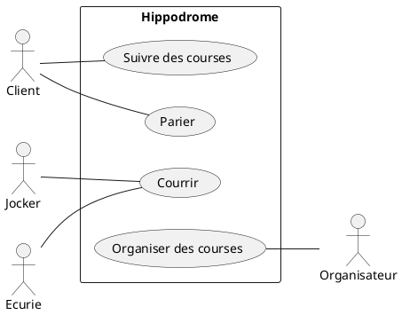

### Bilan des tâches effectuées lors de la scéance 4
##### *02 / 10 / 2018*

---

#### *<u>Note de TD :</u>*

+ **L'hippodrome (CU)**



+ **La hiérarchie des chevaux**

```puml
skinparam classAttributeIconSize 0
class Troupeau
class Cheval

class Male
class Etalon
class Poulain

class Femelle
class Jument
class Pouliche


Troupeau "1" o-- "2,*" Cheval : contient

Cheval <|-- Male
Cheval <|-- Femelle
Cheval "*" -- "1" Etalon : père
Cheval "*" -- "1" Jument : mère

Male <|-- Etalon
Male <|-- Poulain
Femelle <|-- Jument
Femelle <|-- Pouliche


Poulain -> Etalon : devient
Jument <- Pouliche : devient
```

+ **Les produits pour chevaux**

```puml
skinparam classAttributeIconSize 0

class Produit {
  Nature: Enumere
  stock
}
class Ligne {
  quantité
  numéro
  prix
}
class Commande
class Devis
class Livraison

Produit "1, *" -o "*" Commande : contient
Commande "0, *" --o "1" Devis
(Produit, Commande) -- Ligne
Livraison "1, *" -- "1" Commande
Facture "1, *" -- "1" Livraison
```

---

[:leftwards_arrow_with_hook: Retour à la page d'accueil](../README.md)
