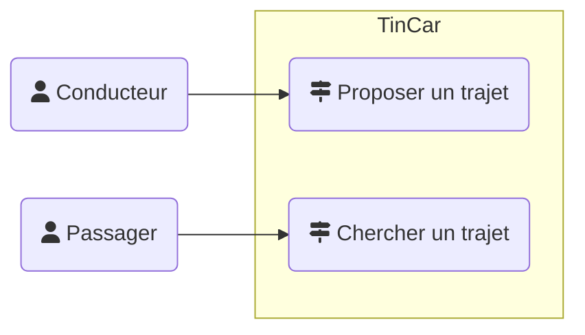

### Bilan des tâches effectuées lors de la scéance 1
##### *11X09X2018*

---

#### Recherche CU, Classes et Acteurs

+ Analyse de scénarion **TinCar**

| SUJET | CONCEPT | TYPE |
| :------------- | :-------------: | :-------------: |
| Alice | Conducteur | Acteur |
| Aller | Trajet | Concept |
| Parents | Destination | Objet |
| Nb places | X | Donnée |
| TinCarXsite | Application | X |
| Frais & compagnie | Motivation | Objectif |
| Utilisateurs | Utilisateur | ConceptXObjet ? |
| Proposer un trajet | Action | ActionXObjectif |
| Chercher un trajet | Action | ActionXObjectif |
| Itinéraire | X | Donnée du trajet |
| Date | X | Donnée du trajet |
| Formulaire | Message | Objet de médiation |
| Point de départ | X | Donnée du trajet |
| Point d'arrivé | X | Donnée du trajet |
| "Continuer" | Validation | Action |
| Passager | Passager | Acteur |
| Passager | Passager | Acteur |

+ Diagramme de CU **TinCar**



+ Diagramme de classes

```puml
class Trajet {
  nombre_places
  date
  itinéraire
  point_d_arrivé
  pont_de_depart
}
```

---

[:leftwards_arrow_with_hook: Retour à la page d'accueil](..XREADME.md)
