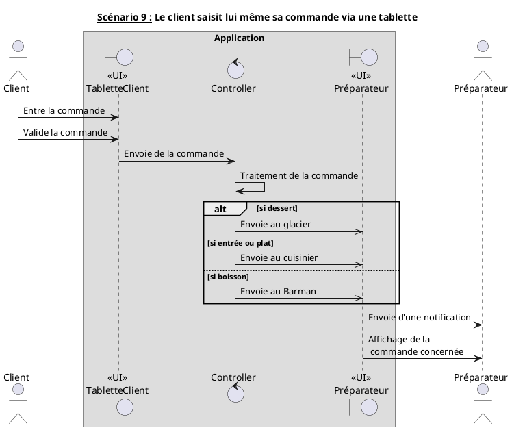
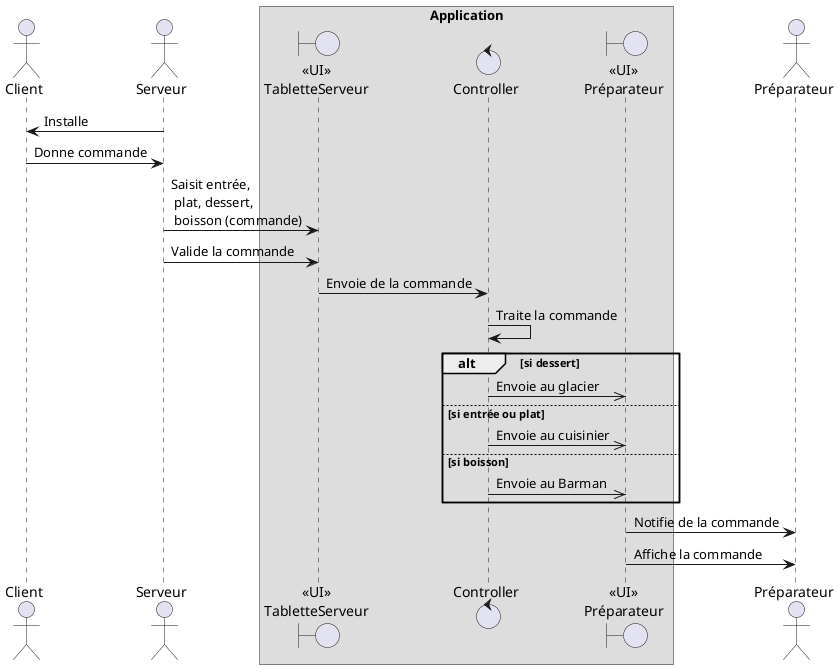
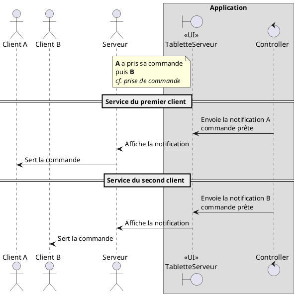
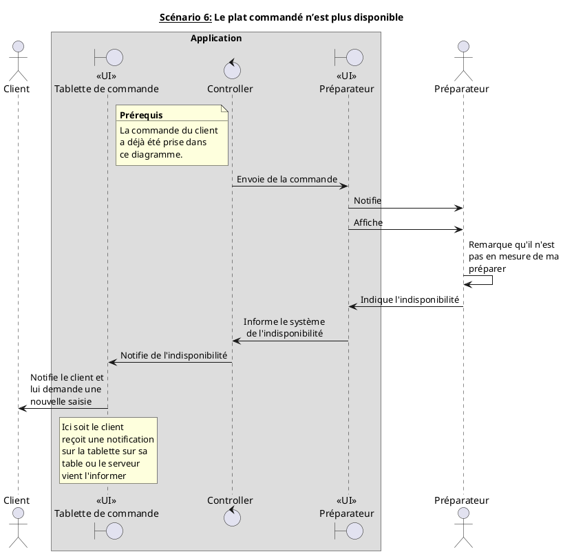
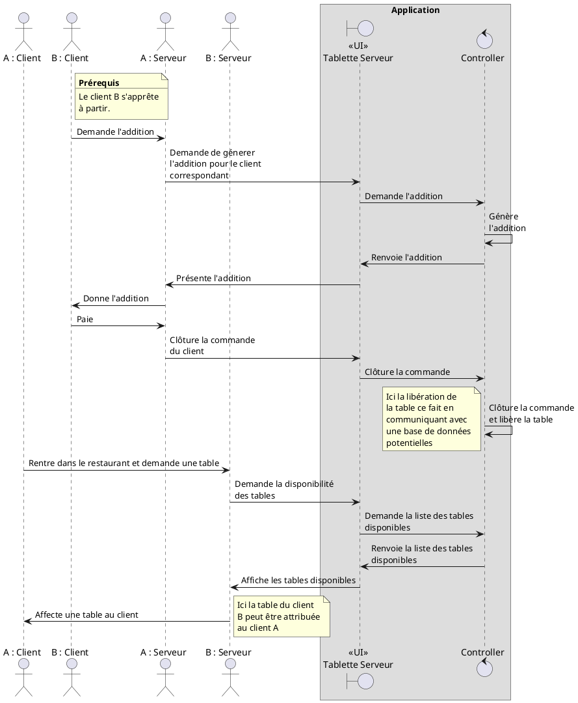
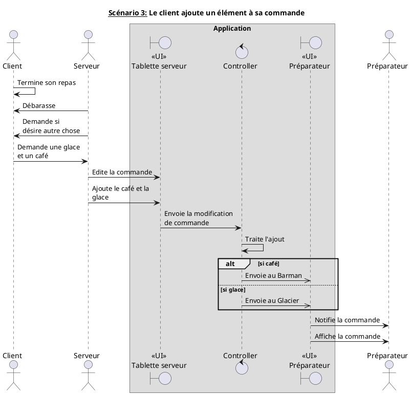
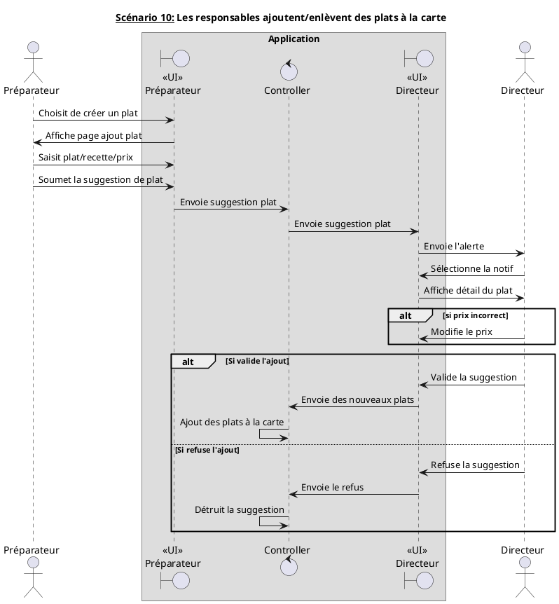

### Bilan des tâches effectuées lors de la scéance 6
##### *23 / 10 / 2018*

---

+ Préparation des diagrammes de séquences

---

---

athée

---

---

---

---

---

---

---

[:leftwards_arrow_with_hook: Retour à la page d'accueil](../README.md)
