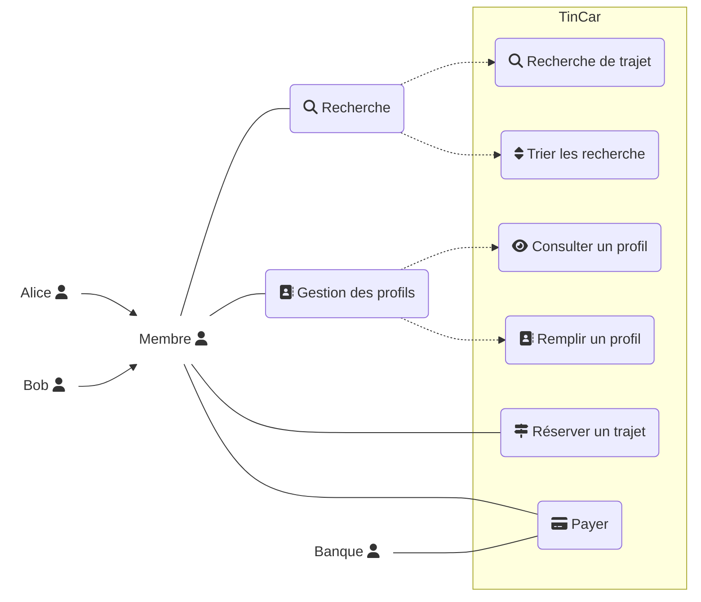

### Bilan des tâches effectuées lors de la scéance 3
##### *25 / 09 / 2018*

---

#### Recherche CU, Classes et Acteurs

+ Analyse de scénarion **TinCar**

| SUJET | TYPE | CONCEPT |
| :---- | :--: | :-----: |
| Bob | Acteur | Passager |
| Mennecy | Objet | Destination / Objet de recherche |
| Budjet | Contrainte | Max |
| Page de recherche | Interface | Recherche de trajets |
| Lille | Objet | Départ / Objet de recherche |
| Résultats | Objet | Liste Résultats |
| Prix | Donnée / Float | Prix |
| Le trajet d'Alice | Objet | Choix |
| Trier | Acteur | Trier / Ordonner |
| Date | Donée / Contrainte | Critère |
| Profil d'Alice | Objet | Profil |
| Taille des bagages | Données / contrainte | Contrainte |
| Niveau d'experience | Donnée | Donnée du profil |
| Réserver | Action / Cas d'utilisation | Réserver |
| Payer | Action | Payer |
| Demande de réservation | Objet |  |
| Mail de récap | Objet mail |  |

+ Diagramme de CU **TinCar**





***<u>Code PlantUML associé :</u>***
>>>
  ```puml
  @startuml
  left to right direction
  skinparam packageStyle rectangle

  :Alice: as Alice
  :Bob: as Bob
  :Banque: as Banque

  Alice --|> Membre
  Bob --|> Membre


  rectangle TinCar {

    (Recherche) as (Recherche)
    (Gestion des profils) as (gestionProfil)

    rectangle {
      (Payer) as (Payer)
      (Réserver un trajet) as (reserverTrajet)
      (Remplir un profil) as (remplirProfil)
      (Consulter un profil) as (consulterProfil)
      (Trier les recherches) as (Trier)
      (Recherche de trajet) as (rechercheTrajet)
    }
  }

  (Membre) -- (Recherche)
  (Membre) -- (gestionProfil)

  (gestionProfil) ..> (consulterProfil)
  (gestionProfil) ..> (remplirProfil)
  (Recherche) ..> (rechercheTrajet)
  (Recherche) ..> (Trier)

  (Banque) -- (Payer)
  (Membre) -- (Payer)
  (Membre) -- (reserverTrajet)
  @enduml
  ```
>>>

+ Diagramme de classes


<!--
```puml
skinparam classAttributeIconSize 0
 class Membre
 class Lieu
 class Passager
 class Vehicle {
   - VolumeMax
 }
 class Conducteur {
   - permis
 }
 class Trajet {
   - dateDepart
   - heureDepart
   - retard
   - prix
 }
 class Transaction
 class PaiementService {
   + Payer (?) : Transaction
 }


 Trajet -- Lieu : départ
 Trajet -- Lieu : arrivée
 Trajet -> Trajet : étapes *

 Conducteur -- Vehicle : bagages

 Conducteur -- Trajet : 1 conducteur
 Passager -- Trajet : passagers

 Transaction -- Conducteur
 Transaction -- Conducteur
 Transaction -- Passager

 Conducteur -|> Membre
 Passager -|> Membre
```
-->

---
#### Bilan TP

- ***Diagramme use case :*** Description des principales fonctionnalités de l'application sous forme de diagramme.
- ***Diagramme UML :*** Premier jet d'équipe sur le diagramme UML.
- ***Organisation :*** Répartition des tâches.

---

[:leftwards_arrow_with_hook: Retour à la page d'accueil](../README.md)
