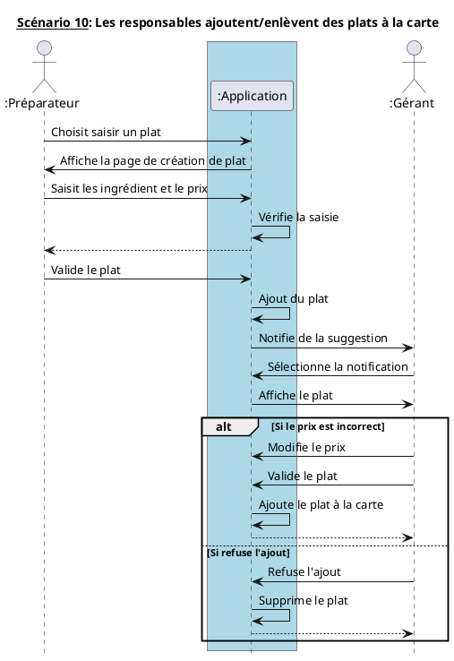

```puml
@startuml
hide footbox
title __Scénario 10__: Les responsables ajoutent/enlèvent des plats à la carte

actor ":Préparateur" as Préparateur order 10
actor ":Gérant" as Gérant order 30

box #Lightblue
    participant ":Application" as app order 20
endbox

Préparateur -> app : Choisit saisir un plat
Préparateur <- app : Affiche la page de création de plat
Préparateur -> app : Saisit les ingrédient et le prix

app -> app : Vérifie la saisie

Préparateur <-- app
Préparateur -> app : Valide le plat

app -> app : Ajout du plat

Gérant <- app : Notifie de la suggestion
Gérant -> app : Sélectionne la notification
Gérant <- app : Affiche le plat

alt Si le prix est incorrect
  Gérant -> app : Modifie le prix
    Gérant -> app : Valide le plat
    app -> app : Ajoute le plat à la carte
    Gérant <-- app
else Si refuse l'ajout
  Gérant -> app : Refuse l'ajout
  app -> app : Supprime le plat
  Gérant <-- app
end

@enduml
```
