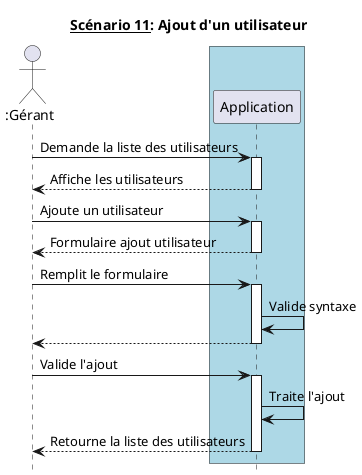

```puml
@startuml
hide footbox
title __Scénario 11__: Ajout d'un utilisateur

actor ":Gérant" as Gérant order 10

box #Lightblue
  participant Application as app order 20
endbox

Gérant -> app : Demande la liste des utilisateurs
activate app
Gérant <-- app : Affiche les utilisateurs
deactivate app
Gérant -> app : Ajoute un utilisateur
activate app
Gérant <-- app : Formulaire ajout utilisateur
deactivate app
Gérant -> app : Remplit le formulaire
activate app
app -> app : Valide syntaxe
Gérant <-- app
deactivate app
Gérant -> app : Valide l'ajout
activate app
app -> app : Traite l'ajout
Gérant <-- app : Retourne la liste des utilisateurs
deactivate app


@enduml
```
