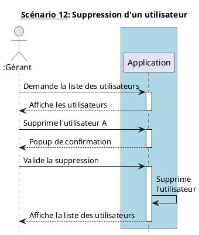

```puml
@startuml
hide footbox
title __Scénario 12__: Suppression d'un utilisateur

actor ":Gérant" as Gérant order 10

box #Lightblue
  participant Application as app order 20
endbox

Gérant -> app : Demande la liste des utilisateurs
activate app
app --> Gérant : Affiche les utilisateurs
deactivate app
Gérant -> app : Supprime l'utilisateur A
activate app
app --> Gérant : Popup de confirmation
deactivate app
Gérant -> app : Valide la suppression
activate app
app -> app : Supprime\nl'utilisateur
app --> Gérant : Affiche la liste des utilisateurs
deactivate app

@enduml
```
