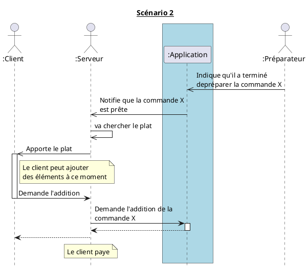

```puml
@startuml
hide footbox
title __Scénario 2__

actor ":Client" as Client order 10
actor ":Serveur" as Serveur order 20
actor ":Préparateur" as Préparateur order 40

box #Lightblue
  participant ":Application" as app order 30
endbox

Préparateur ->> app : Indique qu'il a terminé\ndepréparer la commande X

app ->> Serveur : Notifie que la commande X\nest prête
Serveur ->> Serveur : va chercher le plat
Serveur ->> Client : Apporte le plat
activate Client
note right Client
  Le client peut ajouter
  des éléments à ce moment
end note
Client -> Serveur : Demande l'addition
deactivate Client

Serveur -> app : Demande l'addition de la\ncommande X
activate app
app --> Serveur
deactivate app
Serveur --> Client
note over Serveur
  Le client paye
end note

@enduml
```
