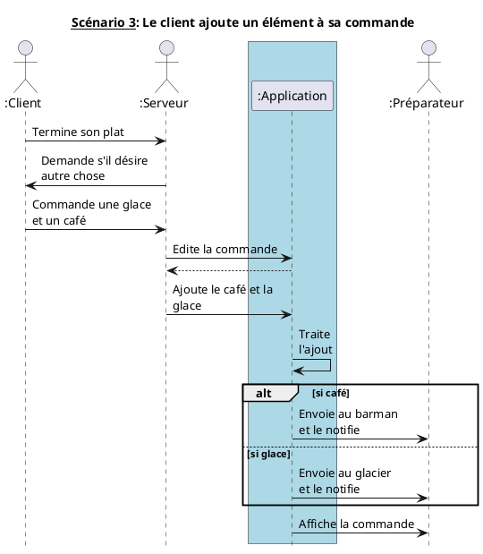

```puml
@startuml
hide footbox
title __Scénario 3__: Le client ajoute un élément à sa commande

actor ":Client" as client order 10
actor ":Serveur" as serveur order 20
actor ":Préparateur" as preparateur order 30
box #Lightblue
    participant ":Application" as app order 20
endbox

client -> serveur : Termine son plat
client <- serveur : Demande s'il désire\nautre chose
client -> serveur : Commande une glace\net un café

serveur -> app : Edite la commande
serveur <-- app
serveur -> app : Ajoute le café et la\nglace

app -> app : Traite\nl'ajout

alt si café
    app -> preparateur : Envoie au barman\net le notifie
else si glace
    app -> preparateur : Envoie au glacier\net le notifie
end

app -> preparateur : Affiche la commande

@enduml
```
