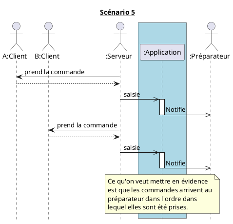

```puml
@startuml
hide footbox
title __Scénario 5__

actor "A:Client" as ClientA order 10
actor "B:Client" as ClientB order 20
actor ":Serveur" as Serveur order 30
actor ":Préparateur" as Préparateur order 50

box #Lightblue
  participant ":Application"  as app order 40
endbox

Serveur -> ClientA : prend la commande
Serveur <-- ClientA

Serveur ->> app : saisie
activate app
app ->> Préparateur : Notifie
deactivate app

Serveur -> ClientB : prend la commande
Serveur <-- ClientB

Serveur ->> app : saisie
activate app
app ->> Préparateur : Notifie
deactivate app
note over app
  Ce qu'on veut mettre en évidence
  est que les commandes arrivent au
  préparateur dans l'ordre dans
  lequel elles sont été prises.
end note

@enduml
```
