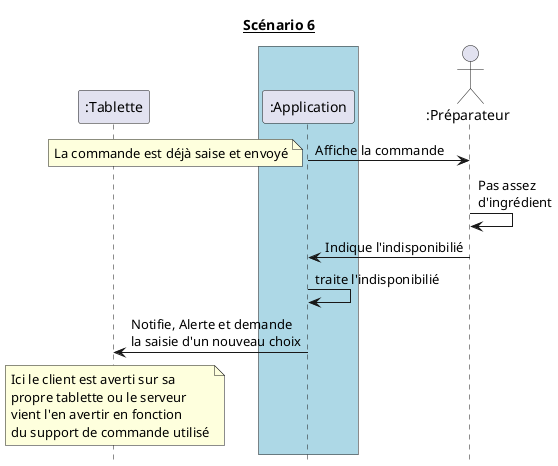

```puml
@startuml
hide footbox
title __Scénario 6__

participant ":Tablette" as Tablette order 10
actor ":Préparateur" as Préparateur order 30

box #Lightblue
  participant ":Application" as Application order 20
endbox

Application -> Préparateur : Affiche la commande
note left: La commande est déjà saise et envoyé

Préparateur -> Préparateur : Pas assez\nd'ingrédient
Préparateur -> Application : Indique l'indisponibilié

Application -> Application : traite l'indisponibilié

Tablette <- Application : Notifie, Alerte et demande\nla saisie d'un nouveau choix

note over Tablette
  Ici le client est averti sur sa
  propre tablette ou le serveur
  vient l'en avertir en fonction
  du support de commande utilisé
end note

@enduml

```
