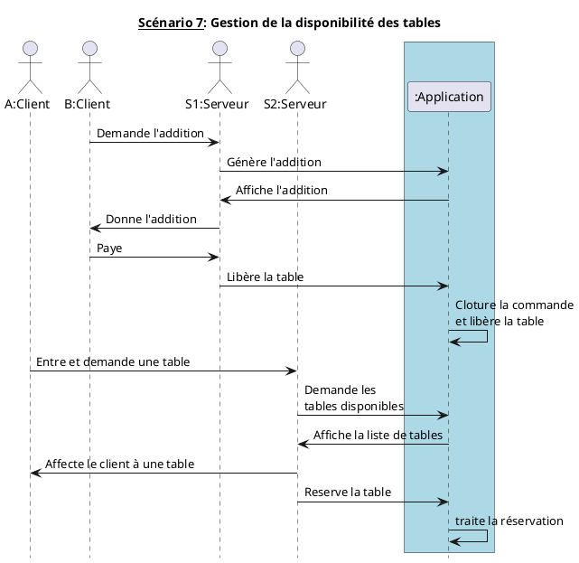

```puml
@startuml
hide footbox
title __Scénario 7__: Gestion de la disponibilité des tables

actor "A:Client" as ClientA order 10
actor "B:Client" as ClientB order 20

actor "S1:Serveur" as Serveur1 order 30
actor "S2:Serveur" as Serveur2 order 40

box #Lightblue
    participant ":Application" as app order 50
endbox

ClientB -> Serveur1 : Demande l'addition
Serveur1 -> app : Génère l'addition
Serveur1 <- app : Affiche l'addition
ClientB <- Serveur1 : Donne l'addition
ClientB -> Serveur1 : Paye
Serveur1 -> app : Libère la table
app -> app : Cloture la commande\net libère la table

ClientA -> Serveur2 : Entre et demande une table
Serveur2 -> app : Demande les\ntables disponibles
Serveur2 <- app : Affiche la liste de tables
Serveur2 -> ClientA : Affecte le client à une table
Serveur2 -> app : Reserve la table
app -> app : traite la réservation

@enduml
```
