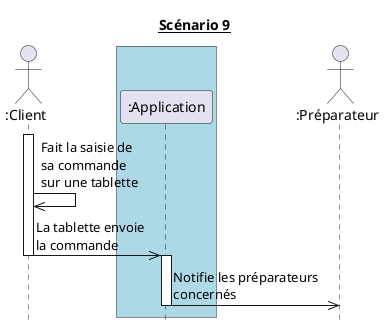

```puml
@startuml
hide footbox
title __Scénario 9__

actor ":Client" as Client order 10
actor ":Préparateur" as Préparateur order 30

box #Lightblue
  participant ":Application" as app order 20
endbox

activate Client
Client ->> Client : Fait la saisie de\nsa commande\nsur une tablette
Client ->> app : La tablette envoie\nla commande
deactivate Client
activate app
app ->> Préparateur : Notifie les préparateurs\nconcernés
deactivate app

@enduml
```
