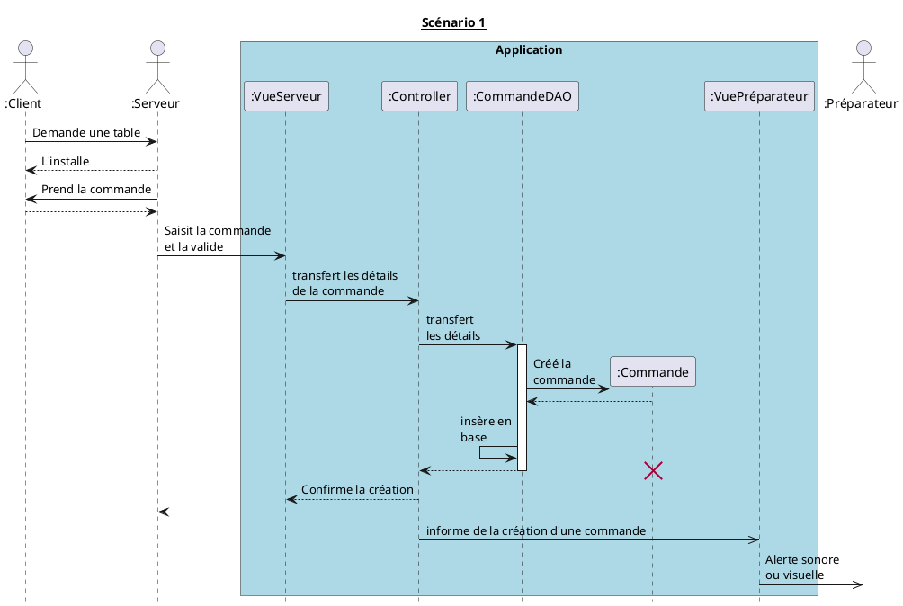

```puml
@startuml
hide footbox
title __Scénario 1__

actor ":Client" as Client order 10
actor ":Serveur" as Serveur order 20
actor ":Préparateur" as Préparateur order 80

box "Application" #Lightblue
  participant ":VueServeur" as VueServeur order 30
  participant ":Controller" as Controller order 40
  participant ":CommandeDAO" as CommandeDAO order 50
  participant ":Commande" as Commande order 60
  participant ":VuePréparateur" as VuePréparateur order 70
endbox

Client -> Serveur : Demande une table
Client <-- Serveur : L'installe
Client <- Serveur : Prend la commande
Client --> Serveur

Serveur -> VueServeur : Saisit la commande\net la valide
VueServeur -> Controller : transfert les détails\nde la commande
Controller -> CommandeDAO : transfert\nles détails
activate CommandeDAO

create Commande
CommandeDAO -> Commande : Créé la\ncommande
CommandeDAO <-- Commande
CommandeDAO <- CommandeDAO : insère en\nbase
CommandeDAO --> Controller
destroy Commande
deactivate CommandeDAO

Controller --> VueServeur : Confirme la création
VueServeur --> Serveur

Controller ->> VuePréparateur : informe de la création d'une commande
VuePréparateur ->> Préparateur : Alerte sonore\nou visuelle

@enduml
```
