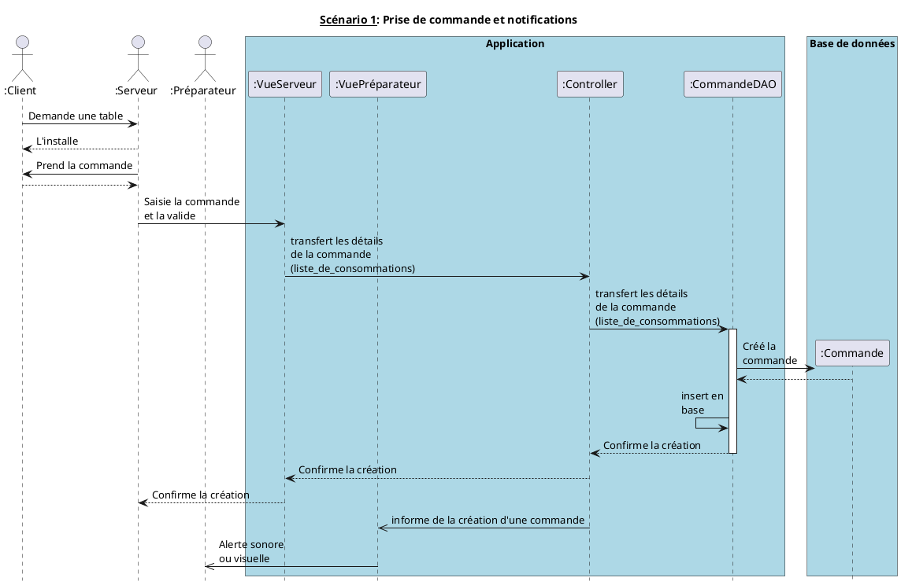

```puml
@startuml
hide footbox
title __Scénario 1__: Prise de commande et notifications

actor ":Client" as Client order 10
actor ":Serveur" as Serveur order 20
actor ":Préparateur" as Préparateur order 30

box "Application" #Lightblue
  participant ":VueServeur" as VueServeur order 40
  participant ":VuePréparateur" as VuePréparateur order 50
  participant ":Controller" as Controller order 60
  participant ":CommandeDAO" as CommandeDAO order 70
endbox

box "Base de données" #Lightblue
  participant ":Commande" as Commande order 80
endbox

Client -> Serveur : Demande une table
Client <-- Serveur : L'installe
Client <- Serveur : Prend la commande
Client --> Serveur

Serveur -> VueServeur : Saisie la commande\net la valide
VueServeur -> Controller : transfert les détails\nde la commande\n(liste_de_consommations)
Controller -> CommandeDAO : transfert les détails\nde la commande\n(liste_de_consommations)

activate CommandeDAO
  create Commande
  CommandeDAO -> Commande : Créé la\ncommande
  CommandeDAO <-- Commande
  CommandeDAO <- CommandeDAO : insert en\nbase
  CommandeDAO --> Controller : Confirme la création
deactivate CommandeDAO

Controller --> VueServeur : Confirme la création
VueServeur --> Serveur : Confirme la création

Controller ->> VuePréparateur : informe de la création d'une commande
VuePréparateur ->> Préparateur : Alerte sonore\nou visuelle

@enduml
```
