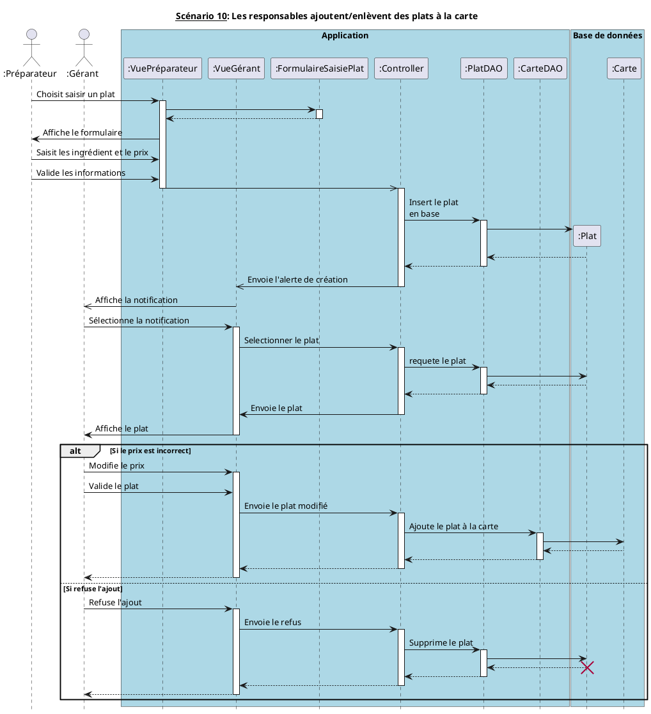

```puml
@startuml
hide footbox
title __Scénario 10__: Les responsables ajoutent/enlèvent des plats à la carte


actor ":Préparateur" as Préparateur order 10
actor ":Gérant" as Gérant order 20

box "Application" #Lightblue
    participant ":VuePréparateur" as VuePréparateur order 30
    participant ":VueGérant" as VueGérant order 40
    participant ":FormulaireSaisiePlat" as FormulaireSaisiePlat order 50
    participant ":Controller" as Controller order 60
    participant ":PlatDAO" as PlatDAO order 70
    participant ":CarteDAO" as CarteDAO order 80
endbox

box "Base de données" #Lightblue
  participant ":Plat" as Plat order 90
  participant ":Carte" as Carte order 100
endbox

Préparateur -> VuePréparateur : Choisit saisir un plat
activate VuePréparateur
VuePréparateur -> FormulaireSaisiePlat
activate FormulaireSaisiePlat
VuePréparateur <-- FormulaireSaisiePlat
deactivate FormulaireSaisiePlat
Préparateur <- VuePréparateur : Affiche le formulaire
Préparateur -> VuePréparateur : Saisit les ingrédient et le prix
Préparateur -> VuePréparateur : Valide les informations
VuePréparateur ->> Controller
deactivate VuePréparateur
activate Controller

Controller -> PlatDAO : Insert le plat\nen base
activate PlatDAO
Create Plat
PlatDAO -> Plat
PlatDAO <-- Plat
Controller <-- PlatDAO
deactivate PlatDAO

Controller ->> VueGérant : Envoie l'alerte de création
deactivate Controller
VueGérant ->> Gérant : Affiche la notification
VueGérant <- Gérant : Sélectionne la notification
activate VueGérant

VueGérant -> Controller : Selectionner le plat
activate Controller
Controller -> PlatDAO : requete le plat
activate PlatDAO

PlatDAO -> Plat
PlatDAO <-- Plat
Controller <-- PlatDAO
deactivate PlatDAO
Controller -> VueGérant : Envoie le plat
deactivate Controller
VueGérant -> Gérant : Affiche le plat
deactivate VueGérant

alt Si le prix est incorrect
    Gérant -> VueGérant : Modifie le prix
    activate VueGérant
    Gérant -> VueGérant : Valide le plat
    VueGérant -> Controller : Envoie le plat modifié
    activate Controller
    Controller -> CarteDAO : Ajoute le plat à la carte
    activate CarteDAO
    CarteDAO -> Carte
    CarteDAO <-- Carte
    Controller <-- CarteDAO
    deactivate CarteDAO
    VueGérant <-- Controller
    deactivate Controller
    Gérant <-- VueGérant
    deactivate VueGérant
else Si refuse l'ajout
  Gérant -> VueGérant : Refuse l'ajout
  activate VueGérant
  VueGérant -> Controller : Envoie le refus
  activate Controller
  Controller -> PlatDAO : Supprime le plat
  activate PlatDAO
  PlatDAO -> Plat
  PlatDAO <-- Plat
  destroy Plat
  Controller <-- PlatDAO
  deactivate PlatDAO
  Controller --> VueGérant
  deactivate Controller
  Gérant <-- VueGérant
  deactivate VueGérant
end

@enduml
```
