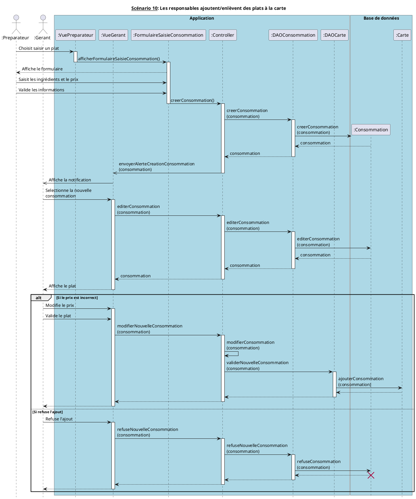

```puml
@startuml
hide footbox
title __Scénario 10__: Les responsables ajoutent/enlèvent des plats à la carte


actor ":Preparateur" as Préparateur order 10
actor ":Gerant" as Gérant order 20

box "Application" #Lightblue
    participant ":VuePreparateur" as VuePréparateur order 30
    participant ":VueGerant" as VueGérant order 40
    participant ":FormulaireSaisieConsommation" as FormulaireSaisiePlat order 50
    participant ":Controller" as Controller order 60
    participant ":DAOConsommation" as PlatDAO order 70
    participant ":DAOCarte" as CarteDAO order 80
endbox

box "Base de données" #Lightblue
  participant ":Consommation" as Plat order 90
  participant ":Carte" as Carte order 100
endbox

Préparateur -> VuePréparateur : Choisit saisir un plat
activate VuePréparateur
VuePréparateur -> FormulaireSaisiePlat : afficherFormulaireSaisieConsommation()
deactivate VuePréparateur
activate FormulaireSaisiePlat
Préparateur <-- FormulaireSaisiePlat :  Affiche le formulaire

Préparateur -> FormulaireSaisiePlat : Saisit les ingrédients et le prix
Préparateur -> FormulaireSaisiePlat : Valide les informations
Controller <- FormulaireSaisiePlat : creerConsommation()

deactivate FormulaireSaisiePlat


activate Controller

Controller -> PlatDAO : creerConsommation\n(consommation)
activate PlatDAO
Create Plat
PlatDAO -> Plat : creerConsommation\n(consommation)
PlatDAO <-- Plat : consommation
Controller <-- PlatDAO : consommation
deactivate PlatDAO

Controller ->> VueGérant : envoyerAlerteCreationConsommation\n(consommation)
deactivate Controller
VueGérant ->> Gérant : Affiche la notification
VueGérant <- Gérant : Selectionne la nouvelle \nconsommation
activate VueGérant

VueGérant -> Controller : editerConsommation\n(consommation)
activate Controller
Controller -> PlatDAO :  editerConsommation\n(consommation)
activate PlatDAO

PlatDAO -> Plat :  editerConsommation\n(consommation)
PlatDAO <-- Plat : consommation
Controller <-- PlatDAO : consommation
deactivate PlatDAO
Controller --> VueGérant : consommation
deactivate Controller
VueGérant --> Gérant : Affiche le plat
deactivate VueGérant

alt #transparent Si le prix est incorrect
    Gérant -> VueGérant : Modifie le prix
    activate VueGérant
    Gérant -> VueGérant : Valide le plat
    VueGérant -> Controller : modifierNouvelleConsommation\n(consommation)
    activate Controller
    Controller -> Controller : modifierConsommation\n(consommation)

    Controller -> CarteDAO : validerNouvelleConsommation\n(consommation)
    activate CarteDAO
    CarteDAO -> Carte : ajouterConsommation\n(consommation)
    CarteDAO <-- Carte
    Controller <-- CarteDAO
    deactivate CarteDAO
    VueGérant <-- Controller
    deactivate Controller
    Gérant <-- VueGérant
    deactivate VueGérant
else Si refuse l'ajout
  Gérant -> VueGérant : Refuse l'ajout
  activate VueGérant
  VueGérant -> Controller : refuseNouvelleConsommation\n(consommation)
  activate Controller
  Controller -> PlatDAO : refuseNouvelleConsommation\n(consommation)
  activate PlatDAO
  PlatDAO -> Plat : refuseConsommation\n(consommation)
  PlatDAO <-- Plat
  destroy Plat
  Controller <-- PlatDAO
  deactivate PlatDAO
  Controller --> VueGérant
  deactivate Controller
  Gérant <-- VueGérant
  deactivate VueGérant
end

@enduml
```
