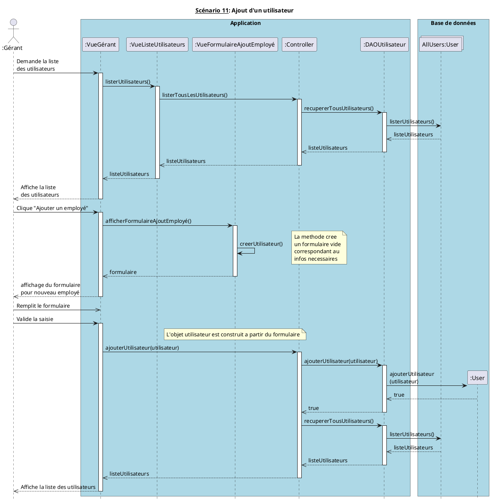

```puml
@startuml
hide footbox
title __Scénario 11__: Ajout d'un utilisateur

actor ":Gérant" as Gérant order 10

box "Application" #Lightblue
  participant ":VueGérant" as VueGérant order 20
  participant ":VueListeUtilisateurs" as VueListeUtilisateurs order 30
  participant ":VueFormulaireAjoutEmployé" as VueFormulaireAjoutEmployé order 40
  participant ":Controller" as Controller order 50
  participant ":DAOUtilisateur" as DAOUtilisateur order 60
endbox

box "Base de données" #Lightblue
  collections "AllUsers:User" as UserList order 70
  participant ":User" as User order 80
endbox


Gérant -> VueGérant : Demande la liste\ndes utilisateurs
activate VueGérant
VueGérant -> VueListeUtilisateurs : listerUtilisateurs()
activate VueListeUtilisateurs
VueListeUtilisateurs -> Controller : listerTousLesUtilisateurs()
activate Controller
Controller -> DAOUtilisateur : recupererTousUtilisateurs()
activate DAOUtilisateur
DAOUtilisateur -> UserList : listerUtilisateurs()
DAOUtilisateur <<-- UserList : listeUtilisateurs
DAOUtilisateur -->> Controller: listeUtilisateurs
deactivate DAOUtilisateur
Controller -->> VueListeUtilisateurs : listeUtilisateurs
deactivate Controller
VueListeUtilisateurs -->> VueGérant : listeUtilisateurs
deactivate VueListeUtilisateurs
VueGérant -->> Gérant : Affiche la liste \ndes utilisateurs
deactivate VueGérant
Gérant -> VueGérant : Clique "Ajouter un employé"
activate VueGérant
VueGérant -> VueFormulaireAjoutEmployé : afficherFormulaireAjoutEmployé()
activate VueFormulaireAjoutEmployé
VueFormulaireAjoutEmployé -> VueFormulaireAjoutEmployé: creerUtilisateur()
note right : La methode cree \nun formulaire vide\ncorrespondant au\ninfos necessaires
VueFormulaireAjoutEmployé -->> VueGérant : formulaire
deactivate VueFormulaireAjoutEmployé
VueGérant -->> Gérant : affichage du formulaire\npour nouveau employé
deactivate VueGérant
Gérant ->> VueGérant : Remplit le formulaire
Gérant -> VueGérant : Valide la saisie
activate VueGérant
note over VueFormulaireAjoutEmployé : L'objet utilisateur est construit a partir du formulaire
VueGérant -> Controller : ajouterUtilisateur(utilisateur)
activate Controller
Controller -> DAOUtilisateur : ajouterUtilisateur(utilisateur)
activate DAOUtilisateur
create User
DAOUtilisateur -> User : ajouterUtilisateur\n(utilisateur)
User -->> DAOUtilisateur : true
DAOUtilisateur -->> Controller : true
deactivate DAOUtilisateur
Controller -> DAOUtilisateur : recupererTousUtilisateurs()
activate DAOUtilisateur
DAOUtilisateur -> UserList : listerUtilisateurs()
UserList -->> DAOUtilisateur : listeUtilisateurs
DAOUtilisateur -->> Controller : listeUtilisateurs
deactivate DAOUtilisateur
Controller -->> VueGérant : listeUtilisateurs
deactivate Controller
VueGérant -->> Gérant : Affiche la liste des utilisateurs
deactivate VueGérant

@enduml
```
