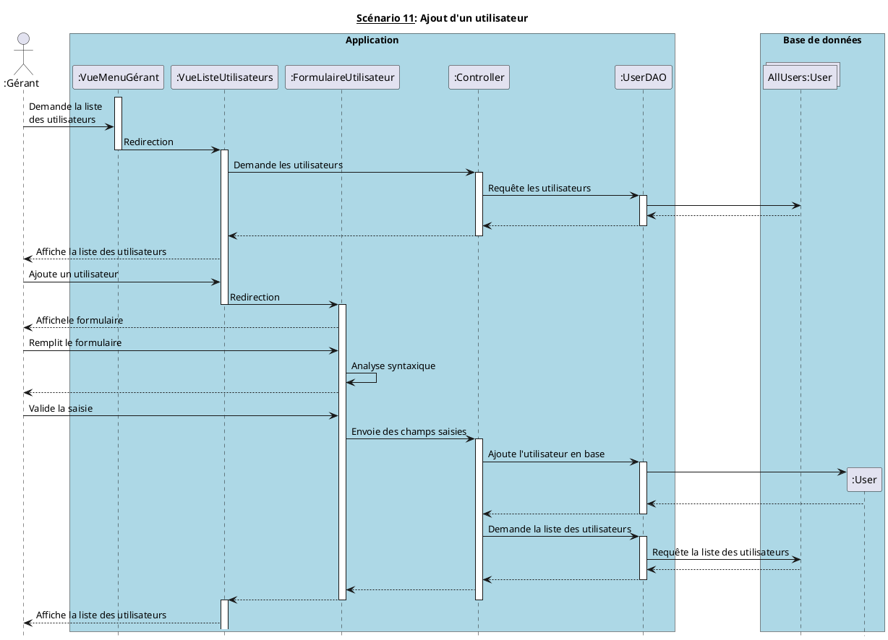

```puml
@startuml
hide footbox
title __Scénario 11__: Ajout d'un utilisateur

actor ":Gérant" as Gérant order 10

box "Application" #Lightblue
  participant ":VueMenuGérant" as VueMenuGérant order 20
  participant ":VueListeUtilisateurs" as VueListeUtilisateurs order 30
  participant ":FormulaireUtilisateur" as FormulaireUtilisateur order 40
  participant ":Controller" as Controller order 50
  participant ":UserDAO" as UserDAO order 60
endbox

box "Base de données" #Lightblue
  collections "AllUsers:User" as UserList order 70
  participant ":User" as User order 80
endbox

activate VueMenuGérant

Gérant -> VueMenuGérant : Demande la liste\ndes utilisateurs
VueMenuGérant -> VueListeUtilisateurs : Redirection
deactivate VueMenuGérant
activate VueListeUtilisateurs
VueListeUtilisateurs -> Controller : Demande les utilisateurs
activate Controller
Controller -> UserDAO : Requête les utilisateurs
activate UserDAO
UserDAO -> UserList
UserDAO <-- UserList
UserDAO --> Controller
deactivate UserDAO
Controller --> VueListeUtilisateurs
deactivate Controller
VueListeUtilisateurs --> Gérant : Affiche la liste des utilisateurs
Gérant -> VueListeUtilisateurs : Ajoute un utilisateur
VueListeUtilisateurs -> FormulaireUtilisateur : Redirection
deactivate VueListeUtilisateurs
activate FormulaireUtilisateur
FormulaireUtilisateur --> Gérant : Affichele formulaire
Gérant -> FormulaireUtilisateur : Remplit le formulaire
FormulaireUtilisateur -> FormulaireUtilisateur : Analyse syntaxique
Gérant <-- FormulaireUtilisateur
Gérant -> FormulaireUtilisateur : Valide la saisie
FormulaireUtilisateur -> Controller : Envoie des champs saisies
activate Controller
Controller -> UserDAO : Ajoute l'utilisateur en base
activate UserDAO
create User
UserDAO -> User
User --> UserDAO
UserDAO --> Controller
deactivate UserDAO
Controller -> UserDAO : Demande la liste des utilisateurs
activate UserDAO
UserDAO -> UserList : Requête la liste des utilisateurs
UserList --> UserDAO
UserDAO --> Controller
deactivate UserDAO
Controller --> FormulaireUtilisateur
FormulaireUtilisateur --> VueListeUtilisateurs
deactivate FormulaireUtilisateur
activate VueListeUtilisateurs
deactivate Controller
VueListeUtilisateurs --> Gérant : Affiche la liste des utilisateurs

@enduml
```
