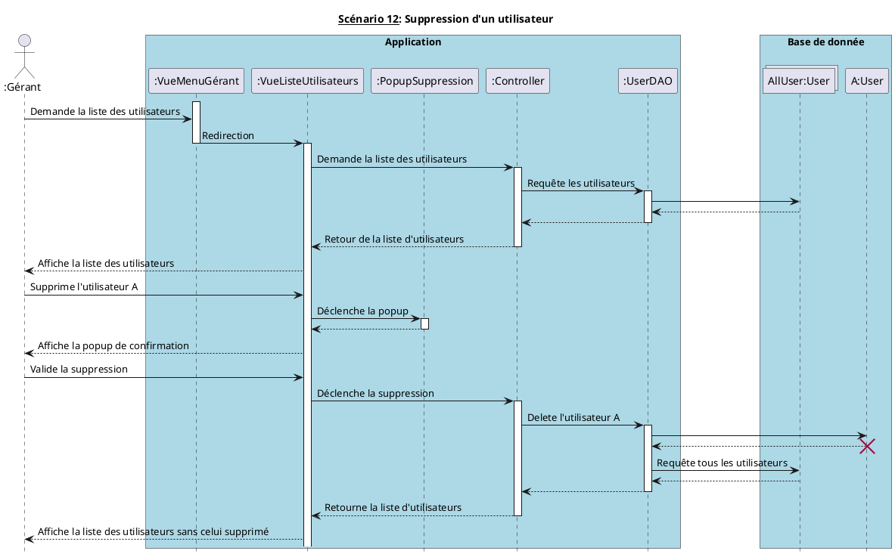

```puml
@startuml
hide footbox
title __Scénario 12__: Suppression d'un utilisateur

actor ":Gérant" as Gérant order 10

box "Application" #Lightblue
  participant ":VueMenuGérant" as VueMenuGérant order 20
  participant ":VueListeUtilisateurs" as VueListeUtilisateurs order 30
  participant ":PopupSuppression" as PopupSuppression order 40
  participant ":Controller" as Controller order 50
  participant ":UserDAO" as UserDAO order 60
endbox

box "Base de donnée" #Lightblue
  collections "AllUser:User" as AllUser order 70
  participant "A:User" as User order 80
endbox

activate VueMenuGérant
Gérant -> VueMenuGérant : Demande la liste des utilisateurs
VueMenuGérant -> VueListeUtilisateurs : Redirection
deactivate VueMenuGérant
activate VueListeUtilisateurs
VueListeUtilisateurs -> Controller : Demande la liste des utilisateurs
activate Controller
Controller -> UserDAO : Requête les utilisateurs
activate UserDAO
UserDAO -> AllUser
UserDAO <-- AllUser
UserDAO --> Controller
deactivate UserDAO
Controller --> VueListeUtilisateurs : Retour de la liste d'utilisateurs
deactivate Controller
VueListeUtilisateurs --> Gérant : Affiche la liste des utilisateurs
Gérant -> VueListeUtilisateurs : Supprime l'utilisateur A
VueListeUtilisateurs -> PopupSuppression : Déclenche la popup
activate PopupSuppression
PopupSuppression --> VueListeUtilisateurs
deactivate PopupSuppression
VueListeUtilisateurs --> Gérant : Affiche la popup de confirmation
Gérant -> VueListeUtilisateurs : Valide la suppression
VueListeUtilisateurs -> Controller : Déclenche la suppression
activate Controller
Controller -> UserDAO : Delete l'utilisateur A
activate UserDAO
UserDAO -> User
User --> UserDAO
destroy User
UserDAO -> AllUser : Requête tous les utilisateurs
AllUser --> UserDAO
UserDAO --> Controller
deactivate UserDAO
Controller --> VueListeUtilisateurs : Retourne la liste d'utilisateurs
deactivate Controller
VueListeUtilisateurs --> Gérant : Affiche la liste des utilisateurs sans celui supprimé
@enduml
```
