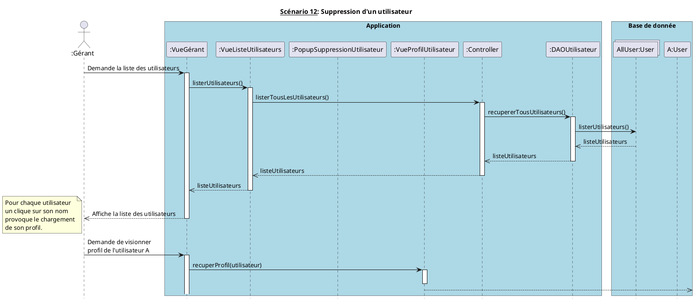

```puml
@startuml
hide footbox
title __Scénario 12__: Suppression d'un utilisateur

actor ":Gérant" as Gérant order 10

box "Application" #Lightblue
  participant ":VueGérant" as VueGérant order 20
  participant ":VueListeUtilisateurs" as VueListeUtilisateurs order 30
  participant ":PopupSuppressionUtilisateur" as PopupSuppressionUtilisateur order 40
  participant ":VueProfilUtilisateur" as VueProfilUtilisateur  order 50
  participant ":Controller" as Controller order 60
  participant ":DAOUtilisateur" as DAOUtilisateur order 70
endbox

box "Base de donnée" #Lightblue
  collections "AllUser:User" as AllUser order 80
  participant "A:User" as User order 90
endbox


Gérant -> VueGérant : Demande la liste des utilisateurs
activate VueGérant
VueGérant -> VueListeUtilisateurs : listerUtilisateurs()
activate VueListeUtilisateurs
VueListeUtilisateurs -> Controller : listerTousLesUtilisateurs()
activate Controller
Controller -> DAOUtilisateur :  recupererTousUtilisateurs()
activate DAOUtilisateur
DAOUtilisateur -> AllUser : listerUtilisateurs()
DAOUtilisateur <<-- AllUser : listeUtilisateurs
DAOUtilisateur -->> Controller : listeUtilisateurs
deactivate DAOUtilisateur
Controller -->> VueListeUtilisateurs : listeUtilisateurs
deactivate Controller
VueListeUtilisateurs -->> VueGérant : listeUtilisateurs
deactivate VueListeUtilisateurs
VueGérant -->> Gérant : Affiche la liste des utilisateurs
note left : Pour chaque utilisateur\nun clique sur son nom\nprovoque le chargement\nde son profil.
deactivate VueGérant
Gérant -> VueGérant : Demande de visionner \nprofil de l'utilisateur A
activate VueGérant
VueGérant -> VueProfilUtilisateur : recuperProfil(utilisateur)
activate VueProfilUtilisateur

deactivate VueProfilUtilisateur
VueProfilUtilisateur -->>
@enduml
```
