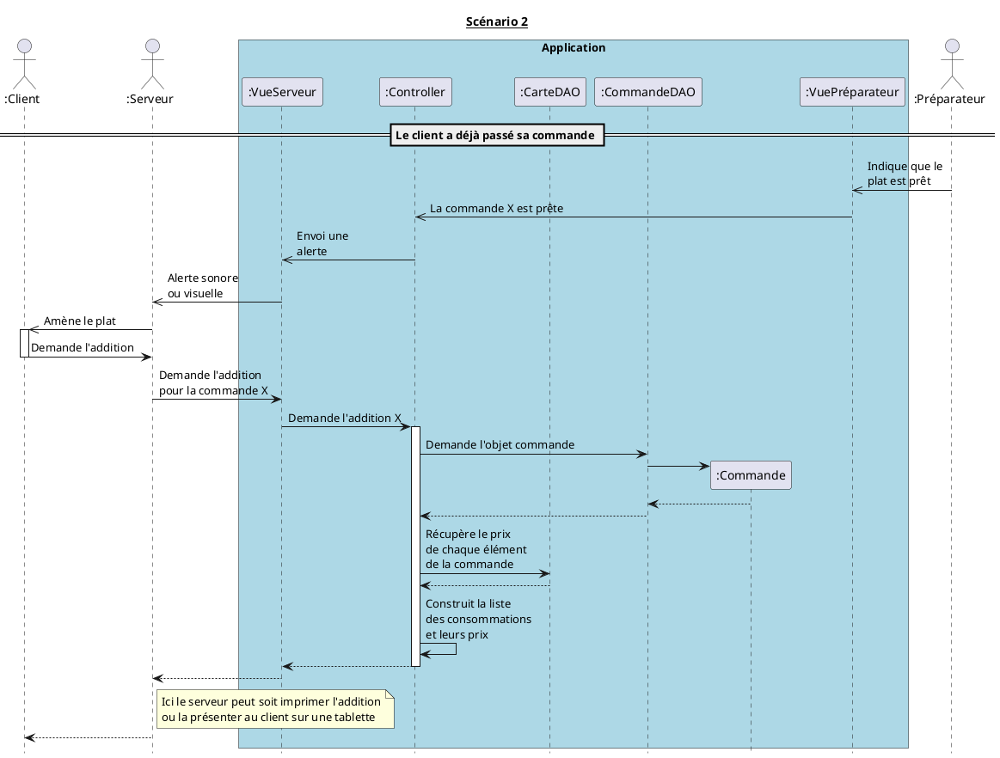

```puml
@startuml
hide footbox
title __Scénario 2__

actor ":Client" as Client order 10
actor ":Serveur" as Serveur order 20
actor ":Préparateur" as Préparateur order 90

box "Application" #Lightblue
  participant ":VueServeur" as VueServeur order 30
  participant ":Controller" as Controller order 40
  participant ":CarteDAO" as CarteDAO order 50
  participant ":CommandeDAO" as CommandeDAO order 60
  participant ":Commande" as Commande order 70
  participant ":VuePréparateur" as VuePréparateur order 80
endbox

== Le client a déjà passé sa commande ==

Préparateur ->> VuePréparateur : Indique que le\nplat est prêt

VuePréparateur ->> Controller : La commande X est prête

Controller ->> VueServeur : Envoi une\nalerte

VueServeur ->> Serveur : Alerte sonore\nou visuelle

Serveur ->> Client : Amène le plat
activate Client
Client -> Serveur : Demande l'addition
deactivate Client

Serveur -> VueServeur : Demande l'addition\npour la commande X

VueServeur -> Controller : Demande l'addition X
activate Controller

Controller -> CommandeDAO : Demande l'objet commande

create Commande
CommandeDAO -> Commande
CommandeDAO <-- Commande

Controller <-- CommandeDAO
Controller -> CarteDAO : Récupère le prix\nde chaque élément\nde la commande
Controller <-- CarteDAO
Controller -> Controller : Construit la liste\ndes consommations\net leurs prix
Controller --> VueServeur
deactivate Controller

VueServeur --> Serveur
note right Serveur
  Ici le serveur peut soit imprimer l'addition
  ou la présenter au client sur une tablette
end note

Serveur --> Client

@enduml
```
