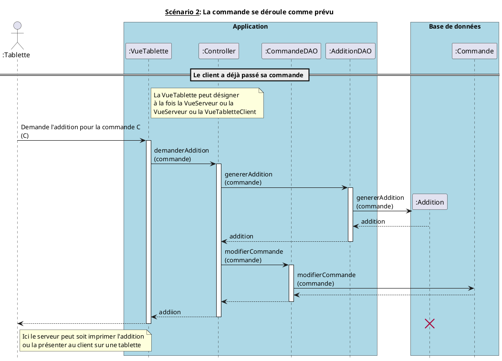

```puml
@startuml
hide footbox
title __Scénario 2__: La commande se déroule comme prévu

actor ":Tablette" as Tablette order 10

box "Application" #Lightblue
  participant ":VueTablette" as VueTablette order 30
  participant ":Controller" as Controller order 40
  participant ":CommandeDAO" as CommandeDAO order 60
  participant ":AdditionDAO" as AdditionDAO order 70

endbox

box "Base de données" #Lightblue
  participant ":Addition" as Addition order 80
  participant ":Commande" as Commande order 90
endbox

== Le client a déjà passé sa commande ==

note right VueTablette
  La VueTablette peut désigner
  à la fois la VueServeur ou la
  VueServeur ou la VueTabletteClient
end note

Tablette -> VueTablette : Demande l'addition pour la commande C\n(C)
activate VueTablette

VueTablette -> Controller : demanderAddition \n(commande)
activate Controller

Controller -> AdditionDAO : genererAddition\n(commande)
activate AdditionDAO

create Addition
AdditionDAO -> Addition : genererAddition\n(commande)
AdditionDAO <-- Addition : addition

Controller <-- AdditionDAO : addition
deactivate AdditionDAO

Controller -> CommandeDAO : modifierCommande\n(commande)
activate CommandeDAO
CommandeDAO -> Commande :  modifierCommande\n(commande)
CommandeDAO <-- Commande
CommandeDAO --> Controller
deactivate CommandeDAO

Controller --> VueTablette : addiion
deactivate Controller

VueTablette --> Tablette
deactivate VueTablette

note right Tablette
  Ici le serveur peut soit imprimer l'addition
  ou la présenter au client sur une tablette
end note
destroy Addition

@enduml
```
