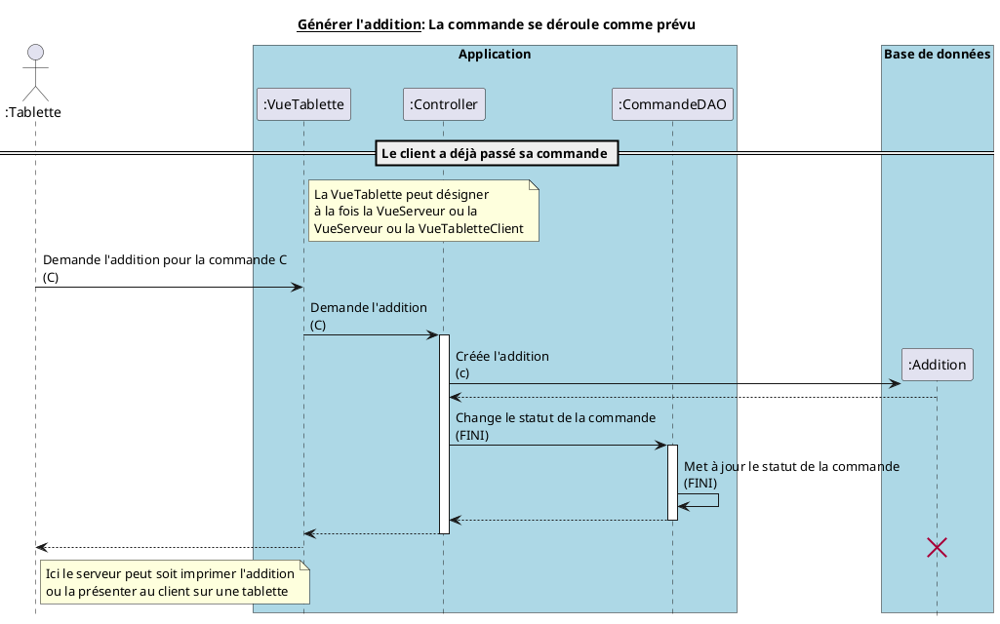

```puml
@startuml
hide footbox
title __Générer l'addition__: La commande se déroule comme prévu

actor ":Tablette" as Tablette order 10

box "Application" #Lightblue
  participant ":VueTablette" as VueTablette order 30
  participant ":Controller" as Controller order 40
  participant ":CommandeDAO" as CommandeDAO order 60
endbox

box "Base de données" #Lightblue
  participant ":Addition" as Addition order 70
endbox

== Le client a déjà passé sa commande ==

note right VueTablette
  La VueTablette peut désigner
  à la fois la VueServeur ou la
  VueServeur ou la VueTabletteClient
end note

Tablette -> VueTablette : Demande l'addition pour la commande C\n(C)

VueTablette -> Controller : Demande l'addition\n(C)
activate Controller

create Addition
Controller -> Addition : Créée l'addition\n(c)
Controller <-- Addition

Controller -> CommandeDAO : Change le statut de la commande\n(FINI)
activate CommandeDAO
CommandeDAO -> CommandeDAO : Met à jour le statut de la commande\n(FINI)
CommandeDAO --> Controller
deactivate CommandeDAO

Controller --> VueTablette
deactivate Controller

VueTablette --> Tablette

note right Tablette
  Ici le serveur peut soit imprimer l'addition
  ou la présenter au client sur une tablette
end note
destroy Addition

@enduml
```
