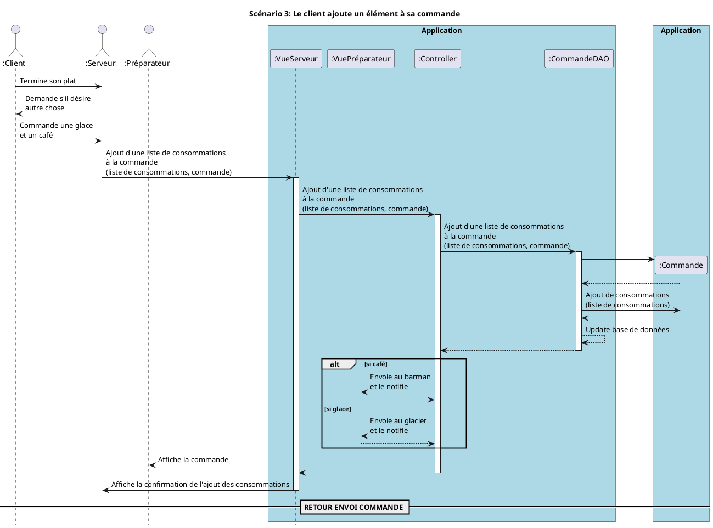

```puml
@startuml
hide footbox
title __Scénario 3__: Le client ajoute un élément à sa commande


actor ":Client" as client order 10
actor ":Serveur" as serveur order 20
actor ":Préparateur" as preparateur order 30

box "Application" #Lightblue
    participant ":VueServeur" as VueServeur order 40
    participant ":VuePréparateur" as VuePréparateur order 50
    participant ":Controller" as Controller order 60
    participant ":CommandeDAO" as CommandeDAO order 70
endbox

box "Application" #Lightblue
  participant ":Commande" as Commande order 80
endbox

client -> serveur : Termine son plat
client <- serveur : Demande s'il désire\nautre chose
client -> serveur : Commande une glace\net un café

serveur -> VueServeur : Ajout d'une liste de consommations \nà la commande\n(liste de consommations, commande)
activate VueServeur
VueServeur -> Controller : Ajout d'une liste de consommations \nà la commande\n(liste de consommations, commande)
activate Controller
Controller -> CommandeDAO : Ajout d'une liste de consommations \nà la commande\n(liste de consommations, commande)

activate CommandeDAO
  create Commande
    CommandeDAO -> Commande
    CommandeDAO <-- Commande
    CommandeDAO -> Commande : Ajout de consommations\n(liste de consommations)
    Commande --> CommandeDAO
CommandeDAO --> CommandeDAO :  Update base de données
Controller <-- CommandeDAO
deactivate CommandeDAO


alt #transparent si café
    Controller -> VuePréparateur : Envoie au barman\net le notifie
    VuePréparateur --> Controller
else si glace
    Controller -> VuePréparateur : Envoie au glacier\net le notifie
    VuePréparateur --> Controller
end

VuePréparateur -> preparateur : Affiche la commande

Controller --> VueServeur
deactivate Controller

VueServeur -> serveur : Affiche la confirmation de l'ajout des consommations
deactivate VueServeur

== RETOUR ENVOI COMMANDE ==

@enduml
```
