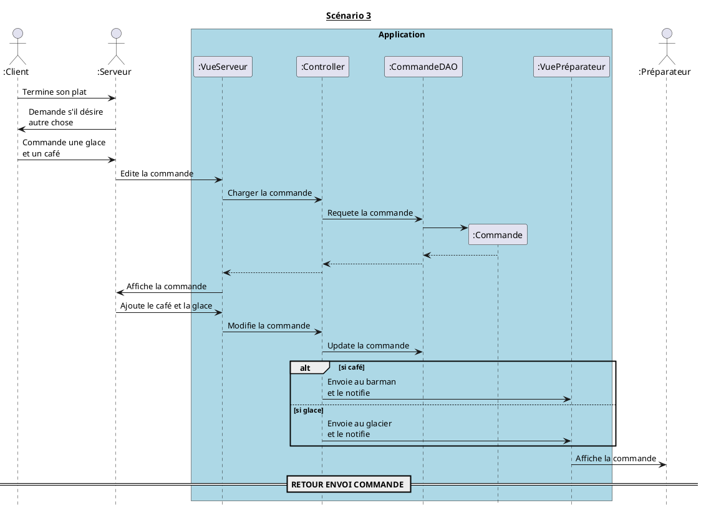

```puml
@startuml
hide footbox
title __Scénario 3__


actor ":Client" as client order 10
actor ":Serveur" as serveur order 20
actor ":Préparateur" as preparateur order 80

box "Application" #Lightblue
    participant ":VueServeur" as VueServeur order 30
    participant ":Controller" as Controller order 40
    participant ":CommandeDAO" as CommandeDAO order 50
    participant ":Commande" as Commande order 60
    participant ":VuePréparateur" as VuePréparateur order 70
endbox

client -> serveur : Termine son plat
client <- serveur : Demande s'il désire\nautre chose
client -> serveur : Commande une glace\net un café

serveur -> VueServeur : Edite la commande
VueServeur -> Controller : Charger la commande
Controller -> CommandeDAO : Requete la commande
create Commande
CommandeDAO -> Commande

CommandeDAO <-- Commande
Controller <-- CommandeDAO
VueServeur <-- Controller
serveur <- VueServeur : Affiche la commande

serveur -> VueServeur : Ajoute le café et la glace
VueServeur -> Controller : Modifie la commande
Controller -> CommandeDAO : Update la commande

alt si café
    Controller -> VuePréparateur : Envoie au barman\net le notifie
else si glace
    Controller -> VuePréparateur : Envoie au glacier\net le notifie
end

VuePréparateur -> preparateur : Affiche la commande

== RETOUR ENVOI COMMANDE ==

@enduml
```
