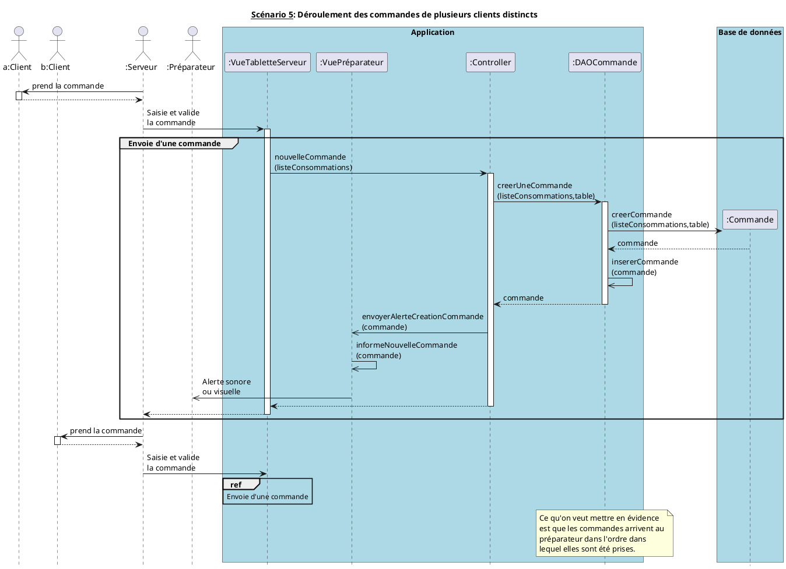

```puml
@startuml
hide footbox
title __Scénario 5__: Déroulement des commandes de plusieurs clients distincts

actor "a:Client" as ClientA order 10
actor "b:Client" as ClientB order 20
actor ":Serveur" as Serveur order 30
actor ":Préparateur" as Préparateur order 40

box "Application" #Lightblue
  participant ":VueTabletteServeur" as VueServeur order 50
  participant ":VuePréparateur" as VuePréparateur order 60
  participant ":Controller" as Controller order 70
  participant ":DAOCommande" as CommandeDAO order 80
endbox

box "Base de données" #Lightblue
  participant ":Commande" as Commande order 90
endbox

Serveur -> ClientA : prend la commande
activate ClientA
Serveur <-- ClientA
deactivate ClientA

Serveur -> VueServeur : Saisie et valide\nla commande
activate VueServeur

group #transparent Envoie d'une commande
  VueServeur -> Controller : nouvelleCommande\n(listeConsommations)
  activate Controller
  Controller -> CommandeDAO : creerUneCommande\n(listeConsommations,table)

  activate CommandeDAO    
    create Commande
    CommandeDAO -> Commande : creerCommande\n(listeConsommations,table)
    CommandeDAO <-- Commande : commande

    CommandeDAO ->> CommandeDAO : insererCommande\n(commande)
    CommandeDAO --> Controller : commande
  deactivate CommandeDAO

  Controller ->> VuePréparateur : envoyerAlerteCreationCommande\n(commande)
  VuePréparateur ->> VuePréparateur : informeNouvelleCommande\n(commande)
  VuePréparateur ->> Préparateur : Alerte sonore\nou visuelle
  Controller --> VueServeur
  deactivate Controller
  VueServeur --> Serveur
  deactivate VueServeur
end

Serveur -> ClientB : prend la commande
activate ClientB
Serveur <-- ClientB
deactivate ClientB

Serveur -> VueServeur : Saisie et valide\nla commande

ref over VueServeur
    Envoie d'une commande
end

note over CommandeDAO
  Ce qu'on veut mettre en évidence
  est que les commandes arrivent au
  préparateur dans l'ordre dans
  lequel elles sont été prises.
end note

@enduml
```
