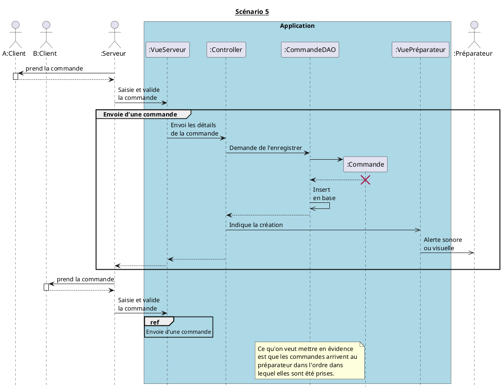

```puml
@startuml
hide footbox
title __Scénario 5__

actor "A:Client" as ClientA order 10
actor "B:Client" as ClientB order 20
actor ":Serveur" as Serveur order 30
actor ":Préparateur" as Préparateur order 90

box "Application" #Lightblue
  participant ":VueServeur" as VueServeur order 40
  participant ":Controller" as Controller order 50
  participant ":CommandeDAO" as CommandeDAO order 60
  participant ":Commande" as Commande order 70
  participant ":VuePréparateur" as VuePréparateur order 80
endbox

Serveur -> ClientA : prend la commande
activate ClientA
Serveur <-- ClientA
deactivate ClientA

Serveur -> VueServeur : Saisie et valide\nla commande

group Envoie d'une commande
  VueServeur -> Controller : Envoi les détails\nde la commande
  Controller -> CommandeDAO : Demande de l'enregistrer

  create Commande
  CommandeDAO -> Commande
  CommandeDAO <-- Commande
  destroy Commande

  CommandeDAO ->> CommandeDAO : Insert\nen base
  CommandeDAO --> Controller

  Controller ->> VuePréparateur : Indique la création
  VuePréparateur ->> Préparateur : Alerte sonore\nou visuelle
  Controller --> VueServeur
  VueServeur --> Serveur
end

Serveur -> ClientB : prend la commande
activate ClientB
Serveur <-- ClientB
deactivate ClientB

Serveur -> VueServeur : Saisie et valide\nla commande

ref over VueServeur
    Envoie d'une commande
end

note over CommandeDAO
  Ce qu'on veut mettre en évidence
  est que les commandes arrivent au
  préparateur dans l'ordre dans
  lequel elles sont été prises.
end note

@enduml
```
