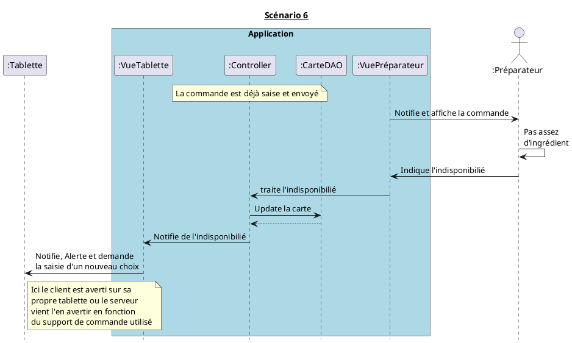

```puml
@startuml
hide footbox
title __Scénario 6__

participant ":Tablette" as Tablette order 10
actor ":Préparateur" as Préparateur order 60

box "Application" #Lightblue
  participant ":VueTablette" as VueTablette order 20
  participant ":Controller" as Controller order 30
  participant ":CarteDAO" as CarteDAO order 40
  participant ":VuePréparateur" as VuePréparateur order 50
endbox

note over Controller
  La commande est déjà saise et envoyé
end note

VuePréparateur -> Préparateur : Notifie et affiche la commande
Préparateur -> Préparateur : Pas assez\nd'ingrédient
Préparateur -> VuePréparateur : Indique l'indisponibilié

VuePréparateur -> Controller : traite l'indisponibilié

Controller -> CarteDAO : Update la carte
Controller <-- CarteDAO

Controller -> VueTablette : Notifie de l'indisponibilié

Tablette <- VueTablette : Notifie, Alerte et demande\nla saisie d'un nouveau choix

note right Tablette
  Ici le client est averti sur sa
  propre tablette ou le serveur
  vient l'en avertir en fonction
  du support de commande utilisé
end note

@enduml
```
