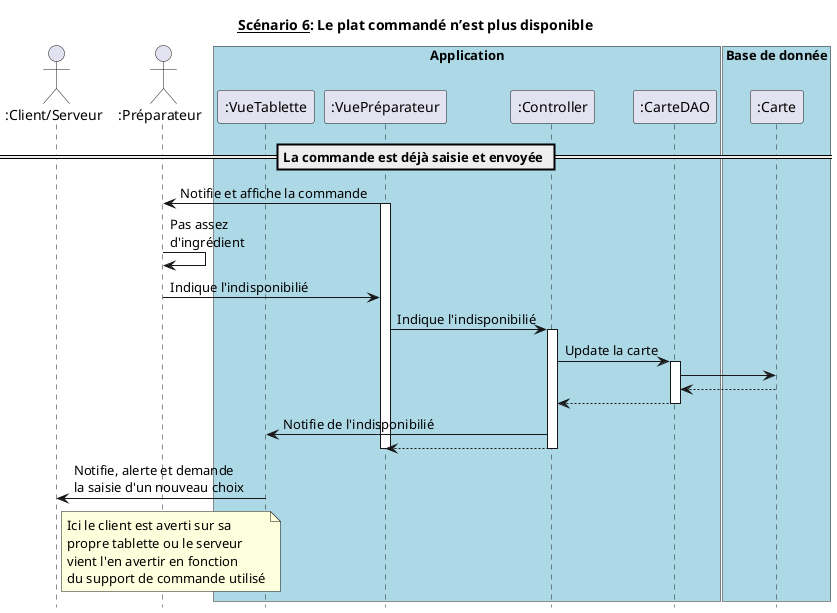

```puml
@startuml
hide footbox
title __Scénario 6__: Le plat commandé n’est plus disponible

actor ":Client/Serveur" as Tablette order 10
actor ":Préparateur" as Préparateur order 20

box "Application" #Lightblue
  participant ":VueTablette" as VueTablette order 30
  participant ":VuePréparateur" as VuePréparateur order 40
  participant ":Controller" as Controller order 50
  participant ":CarteDAO" as CarteDAO order 60
endbox

box "Base de donnée" #Lightblue
  participant ":Carte" as Carte order 70
endbox

== La commande est déjà saisie et envoyée ==

VuePréparateur -> Préparateur : Notifie et affiche la commande
activate VuePréparateur
  Préparateur -> Préparateur : Pas assez\nd'ingrédient
  Préparateur -> VuePréparateur : Indique l'indisponibilié
  VuePréparateur -> Controller : Indique l'indisponibilié
activate Controller

Controller -> CarteDAO : Update la carte
activate CarteDAO
CarteDAO -> Carte
CarteDAO <-- Carte
Controller <-- CarteDAO
deactivate CarteDAO

Controller -> VueTablette : Notifie de l'indisponibilié
Controller --> VuePréparateur
deactivate VuePréparateur
deactivate Controller

Tablette <- VueTablette : Notifie, alerte et demande\nla saisie d'un nouveau choix

note right Tablette
  Ici le client est averti sur sa
  propre tablette ou le serveur
  vient l'en avertir en fonction
  du support de commande utilisé
end note

@enduml
```
