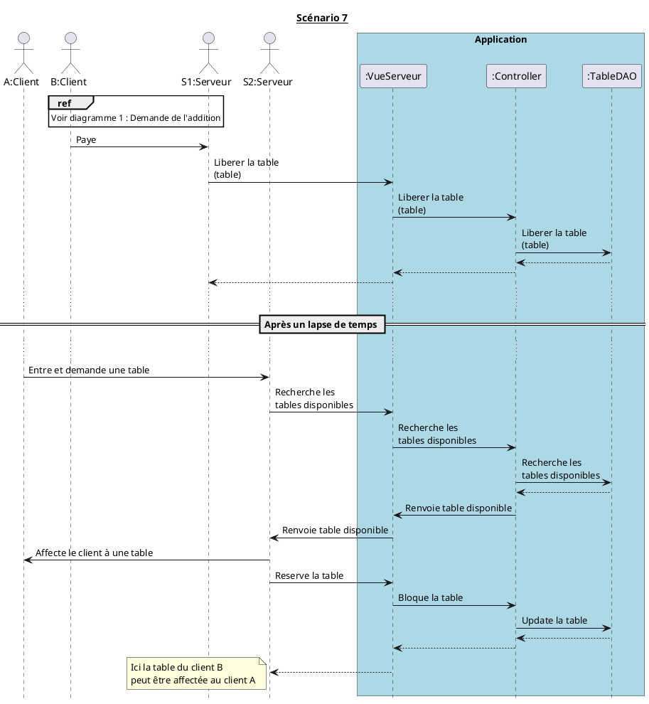

```puml
@startuml
hide footbox
title __Scénario 7__

actor "A:Client" as ClientA order 10
actor "B:Client" as ClientB order 20

actor "S1:Serveur" as Serveur1 order 30
actor "S2:Serveur" as Serveur2 order 40

box "Application" #Lightblue
    participant ":VueServeur" as VueServeur order 50
    participant ":Controller" as Controller order 60
    participant ":TableDAO" as TableDAO order 70
endbox

ref over ClientB
  Voir diagramme 1 : Demande de l'addition
end

ClientB -> Serveur1 : Paye
Serveur1 -> VueServeur : Liberer la table\n(table)
VueServeur -> Controller : Liberer la table\n(table)
Controller -> TableDAO : Liberer la table\n(table)
Controller <-- TableDAO
Controller --> VueServeur
VueServeur --> Serveur1

...
== Après un lapse de temps ==
...

ClientA -> Serveur2 : Entre et demande une table
Serveur2 -> VueServeur : Recherche les\ntables disponibles
VueServeur -> Controller : Recherche les\ntables disponibles
Controller -> TableDAO : Recherche les\ntables disponibles
Controller <-- TableDAO
VueServeur <- Controller : Renvoie table disponible
Serveur2 <- VueServeur : Renvoie table disponible
Serveur2 -> ClientA : Affecte le client à une table

Serveur2 -> VueServeur : Reserve la table
VueServeur -> Controller : Bloque la table
Controller -> TableDAO : Update la table
Controller <-- TableDAO
Controller --> VueServeur
VueServeur --> Serveur2
note left : Ici la table du client B\npeut être affectée au client A

@enduml
```
