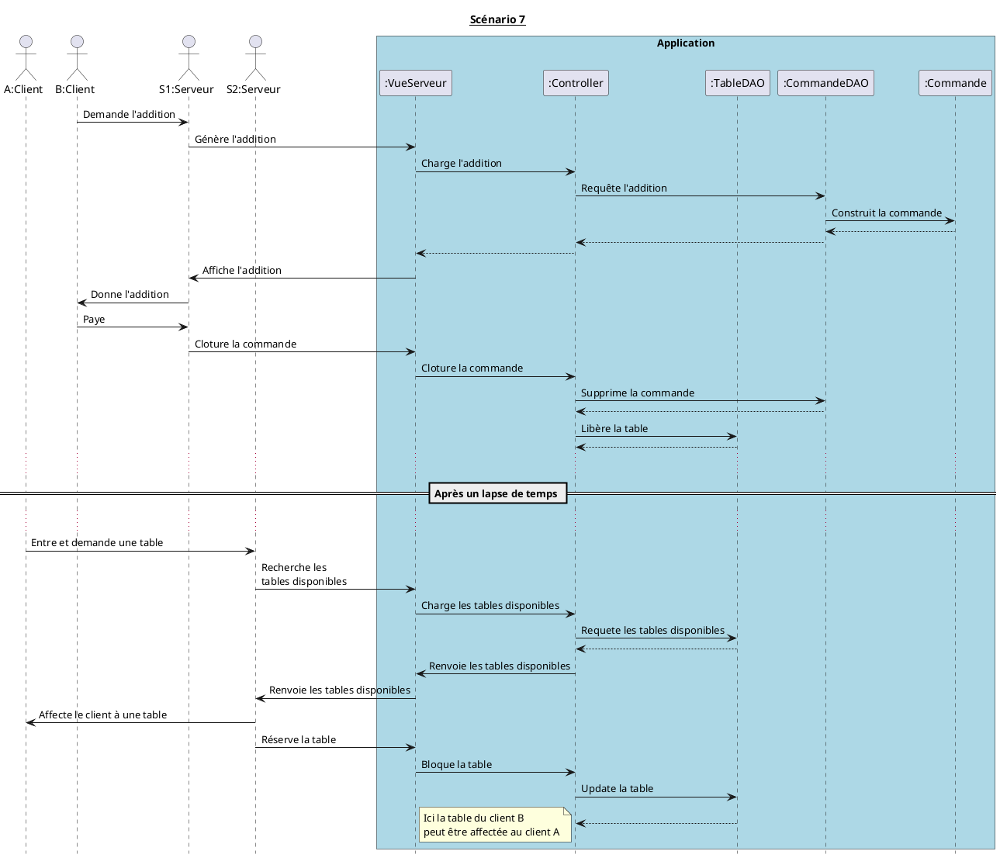

```puml
@startuml
hide footbox
title __Scénario 7__

actor "A:Client" as ClientA order 10
actor "B:Client" as ClientB order 20

actor "S1:Serveur" as Serveur1 order 30
actor "S2:Serveur" as Serveur2 order 40

box "Application" #Lightblue
    participant ":VueServeur" as VueServeur order 50
    participant ":Controller" as Controller order 60
    participant ":TableDAO" as TableDAO order 70
    participant ":CommandeDAO" as CommandeDAO order 80
    participant ":Commande" as Commande order 90
endbox

ClientB -> Serveur1 : Demande l'addition
Serveur1 -> VueServeur : Génère l'addition
VueServeur -> Controller : Charge l'addition
Controller -> CommandeDAO : Requête l'addition
CommandeDAO -> Commande : Construit la commande
CommandeDAO <-- Commande
Controller <-- CommandeDAO
VueServeur <-- Controller
Serveur1 <- VueServeur : Affiche l'addition
ClientB <- Serveur1 : Donne l'addition
ClientB -> Serveur1 : Paye
Serveur1 -> VueServeur : Cloture la commande
VueServeur -> Controller : Cloture la commande
Controller -> CommandeDAO : Supprime la commande
Controller <-- CommandeDAO
Controller -> TableDAO : Libère la table
Controller <-- TableDAO

...
== Après un lapse de temps ==
...

ClientA -> Serveur2 : Entre et demande une table
Serveur2 -> VueServeur : Recherche les\ntables disponibles
VueServeur -> Controller : Charge les tables disponibles
Controller -> TableDAO : Requete les tables disponibles
Controller <-- TableDAO
VueServeur <- Controller : Renvoie les tables disponibles
Serveur2 <- VueServeur : Renvoie les tables disponibles
Serveur2 -> ClientA : Affecte le client à une table

Serveur2 -> VueServeur : Réserve la table
VueServeur -> Controller : Bloque la table
Controller -> TableDAO : Update la table
Controller <-- TableDAO
note left : Ici la table du client B\npeut être affectée au client A

@enduml
```
