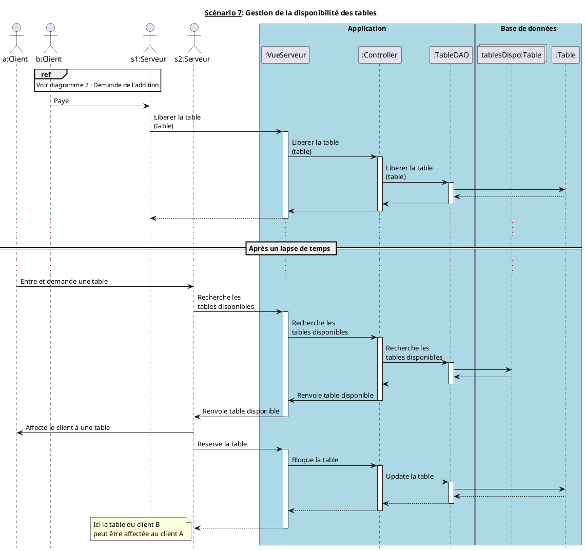

```puml
@startuml
hide footbox
title __Scénario 7__: Gestion de la disponibilité des tables

actor "a:Client" as ClientA order 10
actor "b:Client" as ClientB order 20

actor "s1:Serveur" as Serveur1 order 30
actor "s2:Serveur" as Serveur2 order 40

box "Application" #Lightblue
    participant ":VueServeur" as VueServeur order 50
    participant ":Controller" as Controller order 60
    participant ":TableDAO" as TableDAO order 70
endbox

box "Base de données" #Lightblue
  collections "tablesDispo:Table" as TableDispo order 80
  participant ":Table" as Table order 90
endbox

ref over ClientB
  Voir diagramme 2 : Demande de l'addition
end

ClientB -> Serveur1 : Paye
Serveur1 -> VueServeur : Liberer la table\n(table)
activate VueServeur
VueServeur -> Controller : Liberer la table\n(table)
activate Controller
Controller -> TableDAO : Liberer la table\n(table)
activate TableDAO
TableDAO -> Table
TableDAO <-- Table
Controller <-- TableDAO
deactivate TableDAO
Controller --> VueServeur
deactivate Controller
VueServeur --> Serveur1
deactivate VueServeur

...
== Après un lapse de temps ==
...

ClientA -> Serveur2 : Entre et demande une table
Serveur2 -> VueServeur : Recherche les\ntables disponibles
activate VueServeur
VueServeur -> Controller : Recherche les\ntables disponibles
activate Controller
Controller -> TableDAO : Recherche les\ntables disponibles
activate TableDAO
TableDAO -> TableDispo
TableDAO <-- TableDispo
Controller <-- TableDAO
deactivate TableDAO
VueServeur <- Controller : Renvoie table disponible
deactivate Controller
Serveur2 <- VueServeur : Renvoie table disponible
deactivate VueServeur
Serveur2 -> ClientA : Affecte le client à une table


Serveur2 -> VueServeur : Reserve la table
activate VueServeur
VueServeur -> Controller : Bloque la table
activate Controller
Controller -> TableDAO : Update la table
activate TableDAO
TableDAO -> Table
TableDAO <-- Table
Controller <-- TableDAO
deactivate TableDAO
Controller --> VueServeur
deactivate Controller
VueServeur --> Serveur2
deactivate VueServeur

note left : Ici la table du client B\npeut être affectée au client A

@enduml
```
