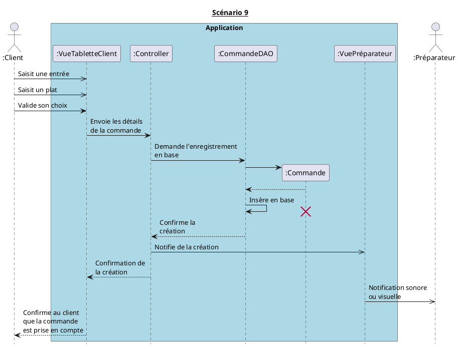

```puml
@startuml
hide footbox
title __Scénario 9__


actor ":Client" as Client order 10
actor ":Préparateur" as Préparateur order 70

box "Application" #Lightblue
    participant ":VueTabletteClient" as VueTabletteClient order 20
    participant ":Controller" as Controller order 30
    participant ":CommandeDAO" as CommandeDAO order 40
    participant ":Commande" as Commande order 50
    participant ":VuePréparateur" as VuePréparateur order 60
endbox

Client ->> VueTabletteClient : Saisit une entrée
Client ->> VueTabletteClient : Saisit un plat
Client -> VueTabletteClient : Valide son choix

VueTabletteClient -> Controller : Envoie les détails\nde la commande

Controller -> CommandeDAO : Demande l'enregistrement\nen base

create Commande
CommandeDAO -> Commande
CommandeDAO <-- Commande
CommandeDAO -> CommandeDAO : Insère en base
destroy Commande
CommandeDAO --> Controller : Confirme la\ncréation

Controller ->> VuePréparateur : Notifie de la création
Controller --> VueTabletteClient : Confirmation de\nla création

VuePréparateur ->> Préparateur : Notification sonore\nou visuelle

VueTabletteClient --> Client : Confirme au client\nque la commande\nest prise en compte

@enduml
```
