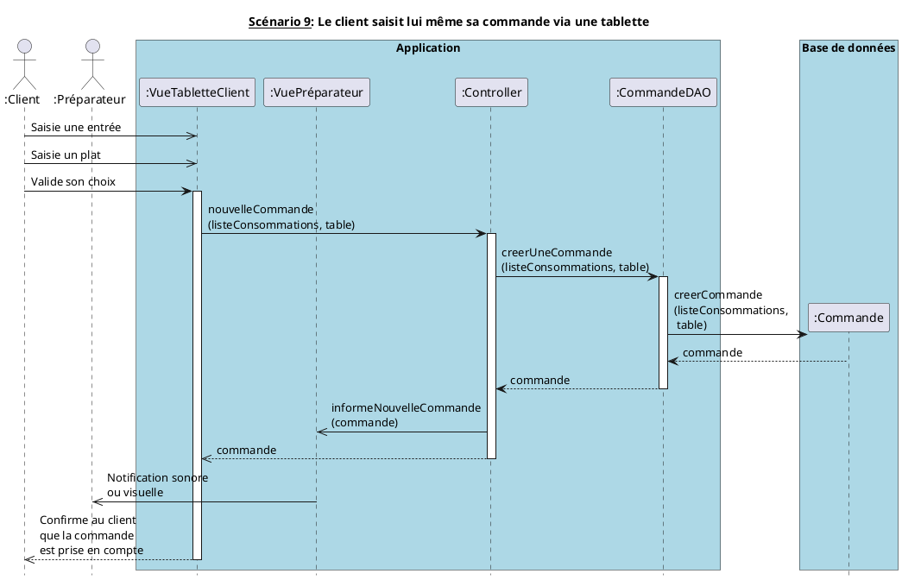

```puml
@startuml
hide footbox
title __Scénario 9__: Le client saisit lui même sa commande via une tablette


actor ":Client" as Client order 10
actor ":Préparateur" as Préparateur order 20

box "Application" #Lightblue
    participant ":VueTabletteClient" as VueTabletteClient order 30
    participant ":VuePréparateur" as VuePréparateur order 40
    participant ":Controller" as Controller order 50
    participant ":CommandeDAO" as CommandeDAO order 60
endbox

box "Base de données" #Lightblue
  participant ":Commande" as Commande order 70
endbox


Client ->> VueTabletteClient : Saisie une entrée
Client ->> VueTabletteClient : Saisie un plat
Client -> VueTabletteClient : Valide son choix
activate VueTabletteClient

VueTabletteClient -> Controller : nouvelleCommande\n(listeConsommations, table)
activate Controller

Controller -> CommandeDAO : creerUneCommande\n(listeConsommations, table)
activate CommandeDAO

create Commande
CommandeDAO -> Commande : creerCommande\n(listeConsommations,\n table)
CommandeDAO <-- Commande : commande
CommandeDAO --> Controller : commande
deactivate CommandeDAO

Controller ->> VuePréparateur : informeNouvelleCommande\n(commande)
Controller -->> VueTabletteClient : commande
deactivate Controller

VuePréparateur ->> Préparateur : Notification sonore\nou visuelle

VueTabletteClient -->> Client : Confirme au client\nque la commande\nest prise en compte
deactivate VueTabletteClient

@enduml
```
