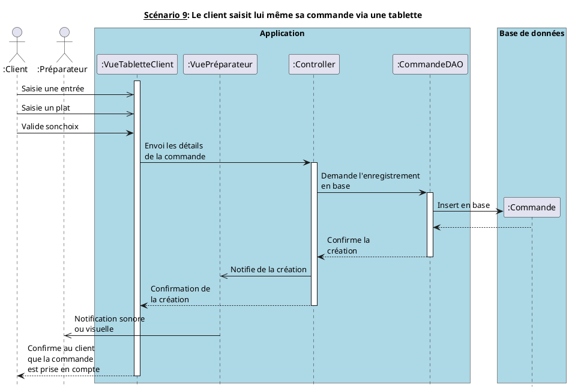

```puml
@startuml
hide footbox
title __Scénario 9__: Le client saisit lui même sa commande via une tablette


actor ":Client" as Client order 10
actor ":Préparateur" as Préparateur order 20

box "Application" #Lightblue
    participant ":VueTabletteClient" as VueTabletteClient order 30
    participant ":VuePréparateur" as VuePréparateur order 40
    participant ":Controller" as Controller order 50
    participant ":CommandeDAO" as CommandeDAO order 60
endbox

box "Base de données" #Lightblue
  participant ":Commande" as Commande order 70
endbox

activate VueTabletteClient

Client ->> VueTabletteClient : Saisie une entrée
Client ->> VueTabletteClient : Saisie un plat
Client -> VueTabletteClient : Valide sonchoix

VueTabletteClient -> Controller : Envoi les détails\nde la commande
activate Controller

Controller -> CommandeDAO : Demande l'enregistrement\nen base
activate CommandeDAO

create Commande
CommandeDAO -> Commande : Insert en base
CommandeDAO <-- Commande
CommandeDAO --> Controller : Confirme la\ncréation
deactivate CommandeDAO

Controller ->> VuePréparateur : Notifie de la création
Controller --> VueTabletteClient : Confirmation de\nla création
deactivate Controller

VuePréparateur ->> Préparateur : Notification sonore\nou visuelle

VueTabletteClient --> Client : Confirme au client\nque la commande\nest prise en compte
deactivate VueTabletteClient

@enduml
```
