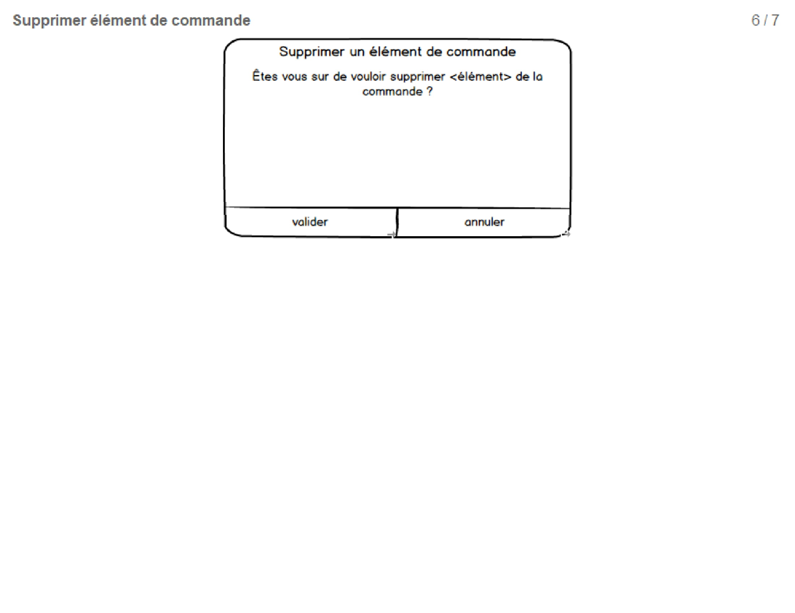

---
phantomjs:
    header:
        height: "9mm"
        contents: "
GL - Les Seigneurs du resto
"
    footer:
        height: "9mm"
        contents:
            default: '<u>Page :</u> {{page}}/{{pages}}'
---

<h1 style="text-align:center">Génie Logiciel
 
Sujet 1 - Prise de commande dans un restaurant
</h1>

  

<table>
<tbody>
<tr><td style="border:none" rowspan="2"></td><th style="border:none">Enseignant responsable du module:  Cedric Dumoulin </th></tr>
<tr><th style="border:none">Enseignant de travaux dirigés:  Michaël Launay </th></tr>
<tbody>
</table>

## Auteurs: Les  seigneurs du resto

>>>
+ Louisa Fodil
+ Valentine Lejeune
+ Alexandre Hulsken
+ Martin Vasilev
+ Rémi Delavalle
>>>

#### M1S1 - Gr.1

---

> Ce projet porte sur l'analyse et la conception d'une application de commande pour un restaurateur.

> L’objectif de l’application est de faciliter la communication entre les différents membres de l’équipe restauratrice et ainsi d’améliorer leur coordination. La réactivité de l’équipe sera améliorée.

---

 

## Table des matières

1. [Bilans de séance](#Bilan1)
    1. [Bilan 11/09/2018](#Bilan1)
    2. [Bilan 25/09/2018](Bilan2)
    2. [Bilan 02/10/2018](Bilan3)
    2. [Bilan 09/10/2018](Bilan4)
    2. [Bilan 23/10/2018](Bilan5)
    2. [Bilan 06/11/2018](Bilan6)
3. [Scénarios possibles d'utilisation](#scenario1)
    1. [Prise de commande et notifications](#scenario1)
    2. [La commande se déroule comme prévu](#scenario2)
    3. [Le client ajoute un élément à sa commande](#scenario3)
    4. [La commande est modifiée](#scenario4)
    5. [Déroulement des commandes de plusieurs clients distincts](#scenario5)
    6. [Le plat commandé n’est plus disponible](#scenario6)
    7. [Ajout ou retrait des tables disponibles](#scenario7)
    8. [Attribution d’une table à un serveur](#scenario8)
    9. [Le client saisit lui même sa commande via une tablette](#scenario9)
    10. [Les responsables ajoutent/enlèvent des plats à la carte](#scenario10)
4. [Tableau Sujet / Concept / Type correspondant à nos scénarios](#tableau)
5. [Diagramme de Cas d'utilisations](#CU)
6. [Diagramme de Classes](#DC)
7. [Diagramme de Séquences](#DS)
    1. [Diagramme de Séquences Simples](#DSS)
    2. [Diagramme de Séquences Détaillés](#DSD)
8. [Maquettes de l'application](#maquette)
    1. [Maquettes de l'interface Gérant](#maquetteGerant)
    2. [Maquettes de l'interface Préparateur](#maquettePreparateur)
    3. [Maquettes de l'interface Serveur](#maquetteTabletteServeur)
    4. [Maquettes de l'interface Client](#maquetteTabletteClient)

+ [[Annexe] Glossaire métier](#glossaire_metier)
+ [[Annexe] Glossaire technique](#glossaire_technique)
+ [[Annexe] Glossaire ingenierie besoins](#glossaire_ingenierie_besoins)
+ [[Annexe] Récapitulation de commandes `GIT` usuelles](#recap_git)

 

### Bilan des tâches {#Bilan1}
##### *11/09/2018*

---

- ***Choix du sujet :*** prise des commandes d’un restaurant
- ***Brainstorming :*** idées des features à développer
- Conception et rédaction des différents scénarios
- Définition des scénarios à préparer pour la séance du 18 septembre.

 

### Bilan des tâches {#Bilan2}
##### *25 / 09 / 2018*

---

- ***Diagramme use case :*** Description des principales fonctionnalités de l'application sous forme de diagramme.
- ***Diagramme UML :*** Premier jet d'équipe sur le diagramme UML.
- ***Organisation :*** Répartition des tâches.

 

### Bilan des tâches {#Bilan3}
##### *02 / 10 / 2018*

---

- travail sur les diagrammes de Cas d'Utilisation
- travail d'équipe sur des choix de conception lors de diagramme UML
- veille technologique et recherche sur des solutions d'exports pdf

 

### Bilan des tâches {#Bilan4}
##### *09 / 10 / 2018*

---

+ Présentation de rendu n°1
+ Refonte des scénarios 1 à 8

 

### Bilan des tâches {#Bilan5}
##### *23 / 10 / 2018*

---

+ Préparation des diagrammes de séquences

 

### Bilan des tâches {#Bilan6}
##### *06 / 11 / 2018*

---

+ Travail de groupe sur les diagrammes de séquences
+ Reflexion sur l'architecture de l'application
+ Préparation des diagrammes de séquences détaillés
+ Préparation de différentes maquettes

 

## Scénarios possibles d'utilisation {#scenario1}

### <u>Scénario 1 :</u> Prise de commande et notifications

> *Ce scénario décrit le déroulement du début à la fin d’une commande et du repas d’un client.*

---

#### Version : 2

#### Auteurs : Martin VASILEV, Valentine LEJEUNE, Alexandre HULSKEN, Louisa FODIL, Rémi DELAVALLE

#### Acteurs principaux : Les clients et le serveur

#### Pré-conditions : Le serveur dispose d'une tablette avec accès à l'application.

#### Déclenchement : Les clients souhaitent prendre une commande.

#### Scénario nominal :

1. Timoléon se rend au restaurant. Un serveur installe Timoléon à une table et prend sa commande.

1. Timoléon souhaite une entrée, un plat, une glace ainsi qu’une boisson.
Le serveur saisit la commande sur sa tablette.

1. Le serveur valide la commande.

1. Les cuisiniers reçoivent la commande de l’entrée et le plat et commencent leurs préparations.
Le barman est notifié de la commande de boisson.
Le glacier reçoit la commande de la glace dans la file d’attente.

#### Post-conditions : Les préparateurs visualisent la commande.

 

### <u>Scénario 2 :</u> La commande se déroule comme prévu {#scenario2}

> *Déroulement normal d'un service*

---

#### Version : 2

#### Auteurs : Martin VASILEV, Valentine LEJEUNE, Alexandre HULSKEN, Louisa FODIL, Rémi DELAVALLE

#### Acteurs principaux : Les clients et le serveur

#### Pré-conditions : Le serveur dispose d'une tablette avec accès à l'application.

#### Déclenchement : Le serveur reçoit une notification de fin de préparation.

#### Scénario nominal :

1. Le serveur est notifié lorsque la boisson est prête.
Le serveur amène la boisson à Timoléon.

1. Le serveur est notifié lorsque l’entrée est prête. Il la sert à Timoléon.

1. Lorsque Timoléon a fini son entrée, le serveur débarrasse la table. Il sert le plat.

1. Le serveur débarrasse le plat et apporte le dessert.

1. Timoléon finit son dessert, il est débarrassé.

1. Le serveur clôture la commande qui disparaît de l’application et peut générer l’addition.

#### Pré-conditions : Le client peut payer l'addition.

 

### <u>Scénario 3 :</u> Le client ajoute un élément à sa commande {#scenario3}

> *Il nous semble nécessaire qu'un client puisse ajouter un élément à sa commande.  Ce scénario n'est pas dans le cahier des charges, il est cependant indispensable à la satisfaction des clients.*

---

#### Version : 2

#### Auteurs : Martin VASILEV, Valentine LEJEUNE, Alexandre HULSKEN, Louisa FODIL, Rémi DELAVALLE

#### Acteurs principaux : Les clients et le serveur

#### Pré-conditions : Le serveur dispose d'une tablette avec accès à l'application.

#### Déclenchement : Le client désire autre chose.

#### Scénario nominal :

1. Timoléon vient de terminer son repas. Il est débarrassé par le serveur.

1. Le serveur demande si Timoléon désire autre chose.

1. Timoléon répond qu’il désire une autre glace ainsi qu’un café.

1. Le serveur notifie le barman et le glacier qui prépare la glace sans attendre.
Le serveur amène la glace et le café à Timoléon.

#### Post-conditions : les préparateurs voient la suite de la commande.

 

### <u>Scénario 4 :</u> La commande est modifiée {#scenario4}

> *Ce scénario peut intervenir à tout moment. Il nous semble important que le client puisse modifier sa commande.  Ce scénario n'est pas dans le cahier des charges fourni.*

---
#### Version : 2

#### Auteurs : Martin VASILEV, Valentine LEJEUNE, Alexandre HULSKEN, Louisa FODIL, Rémi DELAVALLE

:warning:Ce scénario sera explicité dans une version ultérieure de notre logiciel. 

 

### <u>Scénario 5 :</u> Déroulement des commandes de plusieurs clients distincts {#scenario5}

> *Ce scénario décrit le déroulement des commandes et du service en fonction de l’ordre d’arrivée des différents clients. Le but est de montrer que le logiciel traite les commandes de manière séquentielle.*

---

#### Version : 2

#### Auteurs : Martin VASILEV, Valentine LEJEUNE, Alexandre HULSKEN, Louisa FODIL, Rémi DELAVALLE

#### Acteurs principaux : Bob, Timoléon et un serveur.

#### Pré-conditions : Timoléon a réalisé une commande.

#### Déclenchement : Bob prend une commande.

#### Scénario nominal :

1. Bob arrive au restaurant, le serveur prend sa commande : entrée, plat, dessert.

1. La commande est envoyée à la cuisine (resp. bar, resp. glacier). La commande de Bob apparaît après celle de Timoléon dans la file des plats (resp. boisson, resp. glaces) à préparer.

1. Bob est servi après Timoléon.

#### Post-conditions : Les préparateurs voient les commandes par ordre d'arrivée {#scenario6}

 

### <u>Scénario 6 :</u> Le plat commandé n’est plus disponible

> *Ce scénario intervient apres que le client ait fait son choix de plat, dans le cas où la commande est déja envoyée et les préparateurs ne sont plus en mesure de réaliser le plat. Ce scénario n'est pas explicité dans le cahier des charges fourni, mais est indispensable au bon fonctionnement du restaurant.*

---
#### Version : 2

#### Auteurs : Martin VASILEV, Valentine LEJEUNE, Alexandre HULSKEN, Louisa FODIL, Rémi DELAVALLE

#### Acteurs principaux : Préparateurs et le serveur.

#### Pré-conditions : Une commande est reçue par les préparateurs.

#### Déclenchement : Les préparateurs n'ont plus les ingrédients pour confectionner le plat souhaité.

#### Scénario nominal :

1. Les cuisiniers recoivent la commande du client. Il s'apercoivent que le plat n'est plus disponible, ils envoient une notification pour cet évenement.

2. Le plat est retiré de la carte par le préparateur pour le reste du service.

1. Le serveur est notifié de la situation, il informe le client de l'indisponibilié de son plat et lui propose de modifier son choix

1. Le serveur modifie la commande et le cuisinier est notifié à nouveau.

#### Post-conditions : Le préparateurs visualisent le nouveau choix.

 

### <u>Scénario 7 :</u> Gestion de la disponibilité des tables {#scenario7}

> *Le but de ce scénario est de mettre en évidence le fait que notre application gère la disponibilité des tables. Cette fonctionalité peut-être utile si le restaurant possède plusieurs étages par exemple. Ce cas n'est pas dans le cahier des charges fourni.*

---

#### Version : 2

#### Auteurs : Martin VASILEV, Valentine LEJEUNE, Alexandre HULSKEN, Louisa FODIL, Rémi DELAVALLE

#### Acteurs principaux : Deux groupes de clients et un serveur.

#### Pré-conditions : Des clients sont sur le départ et un groupe de client arrive.

#### Déclenchement : Des clients viennent de finir leur repas.

#### Scénario nominal :

1. Timoléon, client du restaurant, demande l'addition à son serveur.

1. Lorsqu'il paye, la libération de la table est prise en compte par l'application.

1. Dès lors, un jeune couple entre dans le restaurant.

1. Le serveur consulte les tables disponibles sur l'application.

1. Le serveur installe les clients.

1. La table n'est désormais plus disponible sur l'application.

#### Post-conditions : Le groupe de client venant d'arriver est installé.

 

### <u>Scénario 8 :</u> Attribution d’un groupe de table à un serveur {#scenario8}

> *Nous voulons inclure la possibilité de gérer la répartition des tables entre les serveurs. Ce scénario n'était pas présent dans le cahier des charges, cependant il est essentiel au bon fonctionnement du restaurant.*

---

#### Version : 2

#### Auteurs : Martin VASILEV, Valentine LEJEUNE, Alexandre HULSKEN, Louisa FODIL, Rémi DELAVALLE

:warning:Ce scénario sera explicité dans une version ultérieure de notre logiciel. 

 

### <u>Scénario 9 :</u> Le client saisit lui même sa commande via une tablette {#scenario9}

> *Ce scénario décrit le déroulement d’une commande prise via une tablette via le client lui-même.*

---

#### Version : 2

#### Auteurs : Rémi DELAVALLE

#### Acteur principal : Bob

#### Pré-conditions : Une tablette avec accès à l'application ets disponible à la table de Bob.

#### Déclenchement : Bob choisit la saisie de commande sur la tablette.

#### Scénario nominal :

1. Bob arrive au restaurant et il s'installe à une table.

1. Il prend sa commande via une tablette.

1. Bob valide sa commande.

#### Post-conditions : Les préparateurs voient la commande de Bob

 

### <u>Scénario 10 :</u> Les responsables ajoutent/enlèvent des plats à la carte {#scenario10}

> *Ce scénario décrit la procédure d'ajout de boissons, repas ou glaces à la carte.*

---

#### Version : 2

#### Auteur : Rémi DELAVALLE

#### Acteurs principaux : Préparateurs et directeur

#### Pré-condition : Le cuisinier à le droit d'ajouter un plat.

#### Déclenchement : Un cuisinier veut ajouter le plat du jour à la carte.

#### Scenario nominal

1. Le cuisinier ajoute le repas du jour à la carte .

1. Il renseigne les ingrédients et quantités et un prix de vente.

1. Le directeur reçoit une notification concernant la demande d'ajout.

1. Le directeur valide l'ajout à la carte.

1. La carte des repas est mise à jour automatiquement.

#### Post-condition : Le plat est disponible sur la carte.

#### Scénarios alternatifs

4. *A.*
    1. Le directeur modifie le prix de vente.
    2. Retour à l'étape 5.

4. *B.*
    1. Le directeur refuse l'ajout du plat.
    2. La demande d'ajout est supprimée.

 

## Tableau Sujet / Type / Concept correspondant à nos scénarios {#tableau}

---

|           Sujet           | Type                       | Concept            |
|:-------------------------:|:-------------------------- |:------------------ |
|       **Timoléon**        | Utilisateur                | Client             |
|        **Serveur**        | Acteur                     | Préparateur        |
|        **Alerte**         | Objet                      | Alerte             |
|       **Commande**        | Action / Cas d'utilisation | Commander          |
|        **Entrée**         | Objet                      | Choix              |
|         **Plat**          | Objet                      | Choix              |
|         **Glace**         | Objet                      | Choix              |
|        **Boisson**        | Objet                      | Choix              |
|       **Cuisinier**       | Acteur                     | Préparateur        |
|        **Barman**         | Acteur                     | Préparateur        |
|     **Notification**      | Objet                      | Alerte             |
|        **Glacier**        | Acteur                     | Préparateur        |
|    **File d'attente**     | Objet                      | Ordonnancement     |
|   **Clôturer commande**   | Action / Cas d'utilisation | Clôture            |
|   **Générer addition**    | Action                     | Payer              |
|  **Disponibilité plat**   | Contrainte                 | Contrainte binaire |
| **Modification commande** | Action / Cas d'utilisation | Modifier           |
|  **Demande d'addition**   | Action / Cas d'utilisation | Payer              |
|   **Attribution table**   | Action                     | Attribuer          |
|  **Attribution serveur**  | Action                     | Attribuer          |
|    **Ajout d'un plat**    | Action / Cas d'utilisation | Ajouter            |
|      **Ingrédients**      | Donnée                     | Element du plat    |
|    **Demande d'ajout**    | Action                     | Ajouter            |
|         **Prix**          | Donnée / Contrainte        | Prix               |
|   **Mise à jour carte**   | Action                     | Actualisation      |
|     **Consommation**      | Donnée                     | Element du menu    |
|         **Carte**         | Objet                      | Liste de choix     |
|        **Profil**         | Objet                      | Profil             |

 

## Diagramme de Cas d'utilisations {#CU}

>>>
Vous pourrez retrouver l'ensemble des diagrammes de cas d'utilisation effectués sur la prise de commande sur notre git. vous pourrez retrouver l'adresse de celui-ci ci-dessous:
https://gitlab-etu.fil.univ-lille1.fr/hulsken/GL
>>>

## Diagramme de Classes {#DC}

---

@import "diagrammes/diagramme.md"

<!--

-->

 

## Diagramme de Séquences {#DS}
### Diagramme de Séquences Simples {#DSS}

---

<!--

-->

@import "diagrammes_sequences/ds1.md"
@import "diagrammes_sequences/ds2.md"
@import "diagrammes_sequences/ds3.md"
@import "diagrammes_sequences/ds5.md"
@import "diagrammes_sequences/ds6.md"
@import "diagrammes_sequences/ds7.md"
@import "diagrammes_sequences/ds10.md"

 

### Diagramme de Séquences Détaillés {#DSD}

---

<!--

-->

@import "diagrammes_sequences_detailles/dss1.md"
@import "diagrammes_sequences_detailles/dss2.md"
@import "diagrammes_sequences_detailles/dss3.md"
@import "diagrammes_sequences_detailles/dss5.md"
@import "diagrammes_sequences_detailles/dss6.md"
@import "diagrammes_sequences_detailles/dss7.md"
@import "diagrammes_sequences_detailles/dss9.md"
@import "diagrammes_sequences_detailles/dss10.md"

 

## Maquettes {#maquette}

### Maquettes de l'interface Gérant {#maquetteGerant}

---

[:open_file_folder: open pdf file](./maquette/maquetteGerant.pdf)

<!--

 

-->

---

### Maquettes de l'interface Préparateur {#maquettePreparateur}

---

[:open_file_folder: open pdf file](./maquette/maquettePreparateur.pdf)

<!--

 

-->

---

### Maquettes de l'interface Serveur {#maquetteTabletteServeur}

---

[:open_file_folder: open pdf file](./maquette/maquetteTabletteServeur.pdf)

<!--

 

-->

---

### Maquettes de l'interface Client {#maquetteTabletteClient}

---

[:open_file_folder: open pdf file](./maquette/maquetteTabletteClient.pdf)

<!--

-->

 

## [Annexe] *Glossaire métier* {#glossaire_metier}

>> *Ce glossaire donne une définition à chaque terme métier utilisé dans la conception de l'application.*

---

#### Carte
Ensemble des consommations proposées aux clients.

#### Consommation
Ensemble des entrées, plats, desserts, boissons, disponible pour le restaurant.

#### Commande
Les consommations demandées par une table.

#### Client
Personne commandant des consommations dans le restaurant.

#### Générer l'addition
A partir des consommations d'une table ou d'un client, génère une liste de consommations, avec leur prix, et calcule le total.

#### Serveur
Personne s'occupant d'une ou plusieures tables.

#### Table
Composée de plusieurs clients.

#### Tablette
Outil éléctronique permettant d'accéder à l'application.

 

### [Annexe] *Glossaire technique* {#glossaire_technique}

>> *Ce glossaire donne une définition à chaque terme technique utilisé dans la conception de l'application.*

---

#### Alerte

Message textuel pouvant être reçu par l'ensemble des employés de l'entreprise.

#### Carte

Ensemble des différents menus proposés par le restaurant.

#### Clôturer une commande

Terminer de manière définitive une commande. La commande est détruite, plus aucune action la concernant n'est possible.

#### Commande

Un ensemble de consommables reservés par un client.

#### Menu

Liste des plats/boissons/desserts proposé par l'entreprise.

#### Notifier

Envoie d'une alerte pour avertir d'un évènement.

#### Poste

Lieu de travail d'un préparateur (cuisine/bar/"glace")

#### Préparateurs

Employé du restaurant s'occupant de la préparation et de l'envoi des commandes.

#### Profil

Profession d'un employé de l'entreprise. (Barman/cuisinier/glacier/serveur/directeur)

 

## [Annexe] *Glossaire de l'ingénierie des besoins* {#glossaire_ingenierie_besoins}

>> *Ce glossaire définit chaque terme technique utilisé dans les étapes de conception de l'application .*

---

#### Alerte

Message textuel pouvant être reçu par l'ensemble des employés de l'entreprise.

#### Notification

Alerte pour avertir d'un évènement.

#### Profil

Profession d'un employé de l'entreprise. (Barman/cuisinier/glacier/serveur/directeur)

#### Modèle

Partie de l'application contenant les données devant figurer dans l'interface graphique.

#### Vue

Partie frontale de l'application, aussi appelée interface graphique.

#### Contrôleur

Partie de l'application où sont codées les actions pouvant être effectuées par l'utilisateur

#### DAO : Data Access Object

Patron de conception permettant de regrouper les accès aux données dans une partie distincte de l'application.

#### Boundary

Interface permettant de faire le lien entre les différents acteurs au sein d'une application.

#### BLL : Business Logic Layer

Couche métier de l'application.

#### UI : User interface

Interface graphique de l'application

#### UX : User Experience (Expérience Utilisateur)

Expérience de l'utilisateur utilisant l'application. Celle-ci est prise en compte lors de la phase conception de l'interface graphique dans laquelle nous identifions les besoins des utilisateurs.

#### Paquetage

Diviser l'architecture applicative en paquetages permets de distinguer les différentes partie de notre application et de séparer les différentes fonctionnalités proposées.

 

### [Annexe] *Récapitulation de commandes `GIT` usuelles* {#recap_git}

---

+ `git status` => voir la liste des fichiers et commits différents entre le repo local et le repo distant
+ `git add <fileName>` => ajout/indexation du fichier `<fileName>`
+ `git commit -m "type(where): what"` => nomination du/des changement(s) ajoutés précédemments (example en Karma commit)
+ `git merge <branchName>` => fusionne la branche actuelle avec la branche `<branchName>`
+ `git push` => ajouts des différents commits sur le repo distant
+ `git pull <branchName>` => merge la branche git distante `<branchName>` avec la branche locale (Si ce paramètre n'est pas précisé cela se fera sur la branche actuelle)
+ `git fetch && git rebase` => applique les différents commits du repo distant sur le repo local
+ `git checkout <fileName>` => supprime les modifications non indexés de `<fileName>`
+ `git branch` => liste toutes les branches du repo locales
+ `git branch -d <branchName>` => supprime la branche `<branchName>`
+ `git checkout <branchName>` => se déplace sur la branche `<branchName>` locale
+ `git checkout -b <branchName>` => crée une nouvelle branch `<branchName>` et se déplace dessus
+ `git reset HEAD` => supprime les commits locaux
