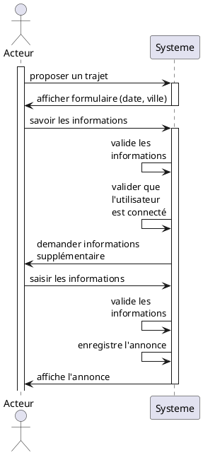
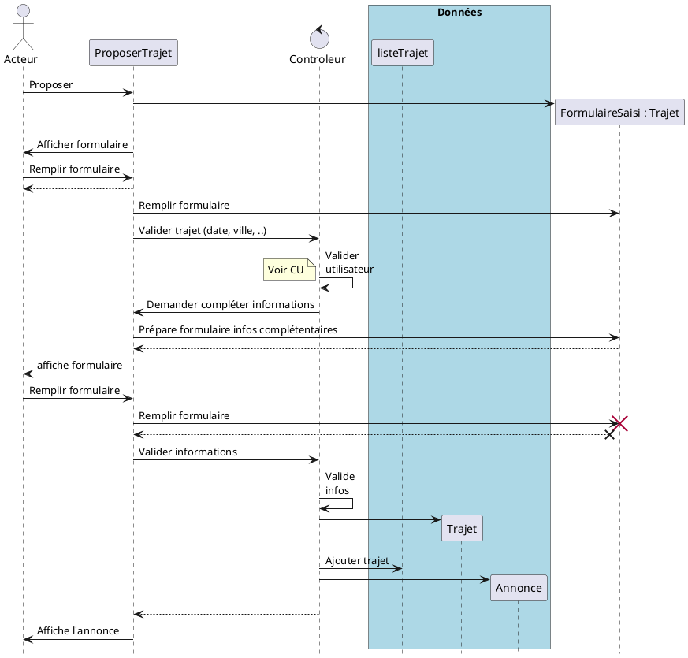
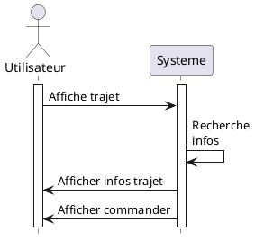
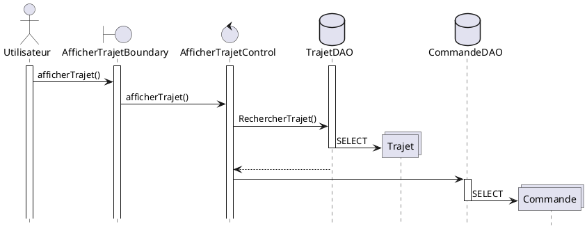

### notes de TD effectuées lors de la scéance 7
##### *06 / 11 / 2018*

---

```puml
@startuml

actor Acteur order 10
activate Acteur
participant Systeme order 20

Acteur -> Systeme : proposer un trajet
activate Systeme
Acteur <- Systeme : afficher formulaire (date, ville)
deactivate Systeme

Acteur -> Systeme : savoir les informations
activate Systeme

Systeme <- Systeme : valide les\ninformations
Systeme <- Systeme : valider que\nl'utilisateur\nest connecté

Acteur <- Systeme : demander informations\nsupplémentaire
Acteur -> Systeme : saisir les informations


Systeme <- Systeme : valide les\ninformations
Systeme <- Systeme : enregistre l'annonce

Acteur <- Systeme : affiche l'annonce
deactivate Systeme

@enduml
```

---

```puml
@startuml
hide footbox

actor Acteur order 10
participant ProposerTrajet order 20

box "Données" #LightBlue
  participant listeTrajet order 40
  participant Trajet order 50
  participant Annonce order 60
endbox

control Controleur order 30


Acteur -> ProposerTrajet : Proposer

create participant "FormulaireSaisi : Trajet" as Formulaire order 70
ProposerTrajet -> Formulaire

Acteur <- ProposerTrajet : Afficher formulaire
Acteur -> ProposerTrajet : Remplir formulaire
Acteur <-- ProposerTrajet

ProposerTrajet -> Formulaire : Remplir formulaire

ProposerTrajet -> Controleur : Valider trajet (date, ville, ..)
Controleur -> Controleur : Valider\nutilisateur
note left : Voir CU
ProposerTrajet <- Controleur : Demander compléter informations

ProposerTrajet -> Formulaire : Prépare formulaire infos complétentaires
ProposerTrajet <-- Formulaire

Acteur <- ProposerTrajet : affiche formulaire
Acteur -> ProposerTrajet : Remplir formulaire

ProposerTrajet -> Formulaire : Remplir formulaire
destroy Formulaire
ProposerTrajet <--x Formulaire

ProposerTrajet -> Controleur : Valider informations
Controleur -> Controleur : Valide\ninfos

create Trajet
Trajet <- Controleur
listeTrajet <- Controleur : Ajouter trajet

create Annonce
Controleur -> Annonce
Controleur --> ProposerTrajet

ProposerTrajet -> Acteur : Affiche l'annonce
@enduml
```

---

```puml
@startuml
hide footbox

actor Utilisateur
participant Systeme
activate Utilisateur
activate Systeme

Utilisateur -> Systeme : Affiche trajet

Systeme -> Systeme : Recherche\ninfos

Utilisateur <- Systeme : Afficher infos trajet
Utilisateur <- Systeme : Afficher commander

@enduml
```

---

```puml
@startuml
hide footbox

actor Utilisateur order 10
boundary AfficherTrajetBoundary order 20
control AfficherTrajetControl order 30
database TrajetDAO order 40
collections Trajet order 50
database CommandeDAO order 60
collections Commande order 70

activate Utilisateur
activate AfficherTrajetBoundary
activate AfficherTrajetControl
activate TrajetDAO

Utilisateur -> AfficherTrajetBoundary : afficherTrajet()
AfficherTrajetControl <- AfficherTrajetBoundary : afficherTrajet()
AfficherTrajetControl -> TrajetDAO : RechercherTrajet()

create Trajet
TrajetDAO -> Trajet : SELECT
deactivate TrajetDAO
TrajetDAO --> AfficherTrajetControl

CommandeDAO <- AfficherTrajetControl
activate CommandeDAO
create Commande
CommandeDAO -> Commande : SELECT
deactivate CommandeDAO

@enduml
```
