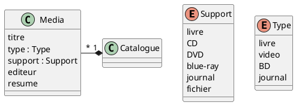
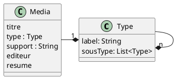
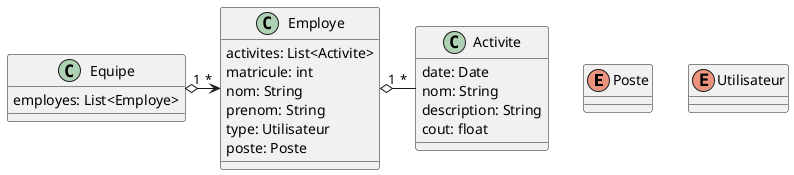

### notes de TD effectuées lors de la scéance 8
##### *06 / 11 / 2018*

---

##### EXERCICE 1

+ Proposition 1

```puml
@startuml

enum Support {
  livre
  CD
  DVD
  blue-ray
  journal
  fichier
}

enum Type {
  livre
  video
  BD
  journal
}

class Media {
  titre
  type : Type
  support : Support
  editeur
  resume
}

class Catalogue

Media "*" -* "1" Catalogue

@enduml
```

+ Proposition 2

```puml
@startuml

class Type {
  label: String
  sousType: List<Type>
}

class Media {
  titre
  type : Type
  support : String
  editeur
  resume
}

Media -* "1" Type
Type -* "n" Type

@enduml
```

---

##### EXERCICE 2

```puml
@startuml

enum Poste {

}

enum Utilisateur {

}

class Equipe {
  employes: List<Employe>
}

class Employe {
  activites: List<Activite>
  matricule: int
  nom: String
  prenom: String
  type: Utilisateur
  poste: Poste
}

class Activite {
  date: Date
  nom: String
  description: String
  cout: float
}

Equipe "1" o-> "*" Employe
Employe "1" o- "*" Activite

@enduml
```
