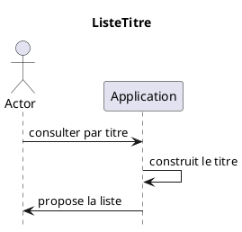
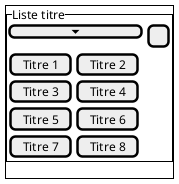
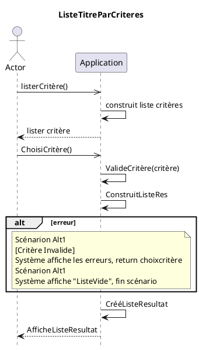

### notes de TD effectuées lors de la scéance 9
##### *20 / 11 / 2018*

---

```puml
@startuml
hidefootbox
title ListeTitre

actor Actor order 10
participant Application order 20

Actor -> Application : consulter par titre
Application -> Application : construit le titre
Application -> Actor : propose la liste

@enduml
```

```puml
@startuml

@startsalt
{+
  {^"Liste titre"
    [              <&caret-bottom>] | [<&filter>]
    {
      [Titre 1] | [Titre 2]
      [Titre 3] | [Titre 4]
      [Titre 5] | [Titre 6]
      [Titre 7] | [Titre 8]
    }
  }
}

@enduml
```

---

```puml
@startuml
hidefootbox
title ListeTitreParCriteres

actor Actor order 10
participant Application order 20

Actor ->> Application : listerCritère()
Application -> Application : construit liste critères
Application --> Actor : lister critère
Actor ->> Application : ChoisiCritère()
Application -> Application : ValideCritère(critère)
Application -> Application : ConstruitListeRes

alt erreur
note over Application
  Scénarion Alt1
  [Critère Invalide]
  Système affiche les erreurs, return choixcritère
  Scénarion Alt1
  Système affiche "ListeVide", fin scénario
end note
end

Application -> Application : CrééListeResultat
Application --> Actor : AfficheListeResultat

@enduml
```

```puml
@startuml

@startsalt
{+
  {^"Liste titre par criteres"
    {
    }
  }
}

@enduml
```
