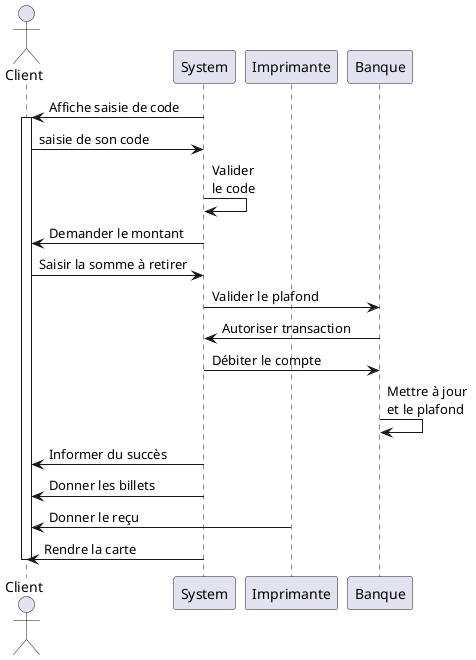
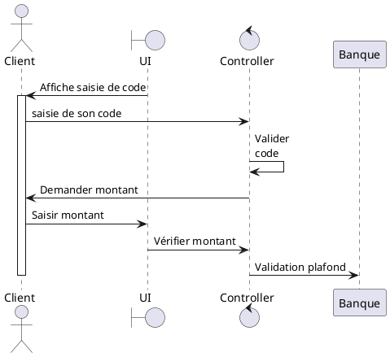
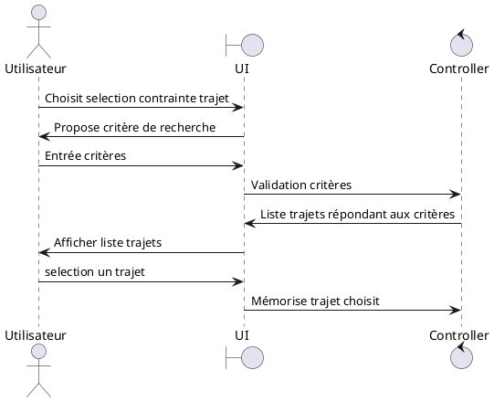

### notes de TD effectuées lors de la scéance 6
##### *23 / 10 / 2018*

---

+ **Retirer de l'argent**

```puml
@startuml

actor Client order 10
participant System order 20
participant Imprimante order 30
participant Banque order 40

Client <- System : Affiche saisie de code
activate Client
Client -> System : saisie de son code
System -> System : Valider\nle code
Client <- System : Demander le montant
Client -> System : Saisir la somme à retirer

System -> Banque : Valider le plafond
System <- Banque : Autoriser transaction

System -> Banque : Débiter le compte

Banque -> Banque : Mettre à jour \net le plafond

Client <- System : Informer du succès
Client <- System : Donner les billets
Client <- Imprimante : Donner le reçu
Client <- System : Rendre la carte
deactivate Client

@enduml
```

```puml
@startuml

actor Client order 10
boundary UI order 20
control Controller order 30
participant Banque order 50

Client <- UI : Affiche saisie de code
activate Client

Client -> Controller : saisie de son code

Controller -> Controller : Valider\ncode

Client <- Controller : Demander montant

Client -> UI : Saisir montant
UI -> Controller : Vérifier montant
Controller -> Banque : Validation plafond
deactivate Client

@enduml
```

+ **TinCAr CU 2**

```puml
@startuml

actor Utilisateur order 10
boundary UI order 20
control Controller order 30

Utilisateur -> UI : Choisit selection contrainte trajet
Utilisateur <- UI : Propose critère de recherche
Utilisateur -> UI : Entrée critères

UI -> Controller : Validation critères
UI <- Controller : Liste trajets répondant aux critères

Utilisateur <- UI : Afficher liste trajets
Utilisateur -> UI : selection un trajet

UI -> Controller : Mémorise trajet choisit
@enduml
```
