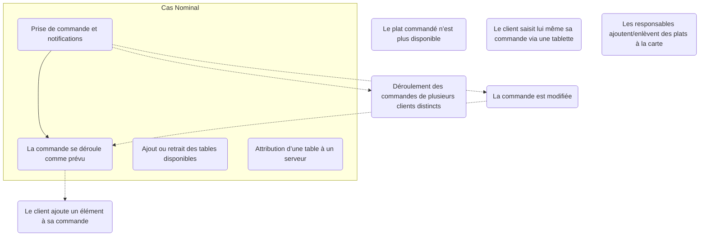

## Schéma de l'avancement des différents scénarios d'utilisation de l'application

```mermaid
graph TB

subgraph Cas Nominal
s1("Prise de commande et notifications")
s2("La commande se déroule comme prévu")
s7("Ajout ou retrait des tables disponibles")
s8("Attribution d’une table à un serveur")
end

s3("Le client ajoute un élément à sa commande")
s4("La commande est modifiée")
s5("Déroulement des commandes de plusieurs clients distincts")
s6("Le plat commandé n’est plus disponible")
s9("Le client saisit lui même sa commande via une tablette")
s10("Les responsables ajoutent/enlèvent des plats à la carte")

click s1 "./scenario_1.md" "Lien vers la description du scénario n°1"
click s2 "./scenario_2.md" "Lien vers la description du scénario n°2"
click s3 "./scenario_3.md" "Lien vers la description du scénario n°3"
click s4 "./scenario_4.md" "Lien vers la description du scénario n°4"
click s5 "./scenario_5.md" "Lien vers la description du scénario n°5"
click s6 "./scenario_6.md" "Lien vers la description du scénario n°6"
click s7 "./scenario_7.md" "Lien vers la description du scénario n°7"
click s8 "./scenario_8.md" "Lien vers la description du scénario n°8"
click s9 "./scenario_9.md" "Lien vers la description du scénario n°9"
click s10 "./scenario_10.md" "Lien vers la description du scénario n°10"

s1 --> s2
s1 -.-> s4
s1 -.-> s5

s2 -.-> s3

s3

s4 -.-> s2

s5

s6

s7

s8

s9

s10
```

[:leftwards_arrow_with_hook: Retour à la page d'accueil](../README.md)
